# Agenten-Architektur: Best-Practice-Patterns

Dieses Dokument beschreibt, wann ein Agent die richtige Wahl ist, wie man ihn sinnvoll aufbaut und welche Patterns sich in der Praxis bewährt haben — inklusive der typischen Fallen.

---

## 1. Wann Agent, wann Workflow?

Die wichtigste Entscheidung kommt zuerst. Ein Agent ist kein Upgrade eines Workflows — er ist ein anderes Werkzeug für ein anderes Problem.

### Der Kernunterschied

| | Workflow | Agent |
|---|---|---|
| **Ablauf** | fest verdrahtet, deterministisch | LLM entscheidet zur Laufzeit |
| **Verzweigungen** | explizit per IF/Switch | implizit durch Tool-Wahl |
| **Debugging** | einfach — Schritt für Schritt nachvollziehbar | schwieriger — LLM-Entscheidungen sind nicht transparent |
| **Zuverlässigkeit** | hoch — gleiche Eingabe, gleicher Ablauf | variabel — gleiche Eingabe kann andere Tools triggern |
| **Sinnvoll wenn** | der Ablauf bekannt und stabil ist | der Ablauf vom Inhalt der Anfrage abhängt |

### Entscheidungsbaum

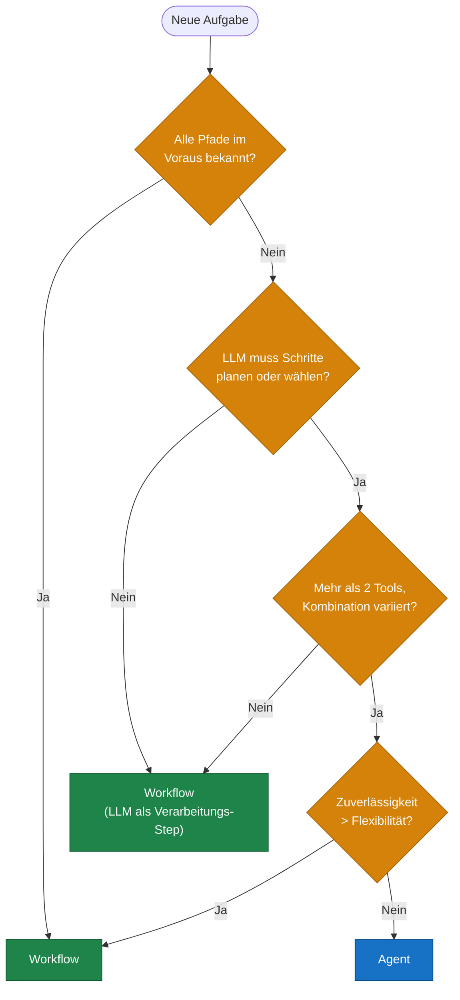

**Faustregel:** Im Zweifel Workflow. Agenten sind mächtiger, aber auch fehleranfälliger und schwerer zu testen. Ein Workflow, der 95% der Fälle abdeckt, ist oft besser als ein Agent, der 100% versucht und dabei 10% falsch macht.

---

## 2. Tool-Design

Tools sind die Schnittstelle zwischen Agent und Welt. Schlechtes Tool-Design ist die häufigste Ursache für schlechte Agenten.

### Grundprinzipien

**Ein Tool, eine Aufgabe.** Tools sollten atomar sein. Kein Tool, das gleichzeitig Daten abruft, transformiert und speichert.

```
❌ get_and_process_and_save_customer_data()
✅ get_customer(id)
✅ update_customer(id, fields)
```

**Sprechende Namen und Beschreibungen.** Das LLM entscheidet anhand der Tool-Beschreibung, ob und wie es ein Tool nutzt. Eine schlechte Beschreibung führt zu falschen oder ausgelassenen Tool-Calls.

```
❌ name: "tool1", description: "does stuff with data"
✅ name: "search_knowledge_base", description: "Durchsucht die interne Wissensdatenbank
   nach relevanten Dokumenten. Nutze dieses Tool, wenn der Nutzer nach internen
   Prozessen, Richtlinien oder Produktinformationen fragt."
```

**Fehler explizit zurückgeben, nicht verschlucken.** Wenn ein Tool fehlschlägt, soll das LLM es wissen — damit es reagieren kann.

```
❌ return null
✅ return { error: "Kunde nicht gefunden", code: "NOT_FOUND",
           suggestion: "Prüfe die Kunden-ID oder nutze search_customer() statt get_customer()" }
```

**Outputs so klein wie nötig.** Große Tool-Outputs fressen Kontext. Gib nur zurück, was der Agent für den nächsten Schritt braucht.

### Tool-Call-Zyklus

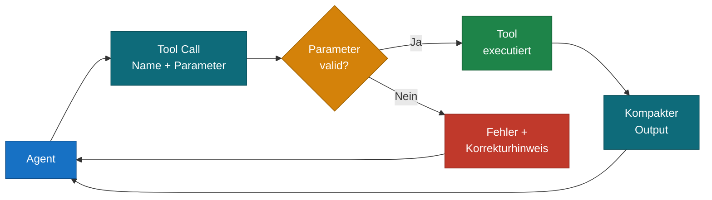

### Tool-Palette dimensionieren

| Anzahl Tools | Verhalten |
|---|---|
| 1–3 | Agent wählt zuverlässig, wenig Fehler |
| 4–8 | Guter Arbeitsbereich, LLM kann noch gut unterscheiden |
| 9–15 | Erste Verwechslungen, ähnliche Tools werden vertauscht |
| 15+ | Zuverlässigkeit sinkt stark — besser auf Sub-Agenten aufteilen |

Bei vielen Tools: **Gruppen bilden** und je Gruppe einen spezialisierten Sub-Agenten einsetzen (siehe Multi-Agent-Patterns).

---

## 3. Memory-Patterns

Agenten haben von sich aus kein Gedächtnis — jeder neue Turn beginnt mit einem leeren Kontext. Memory ist das explizite Gegenmittel.

### Buffer Memory (Konversations-History)

Die letzten N Nachrichten werden direkt in den Kontext geladen.

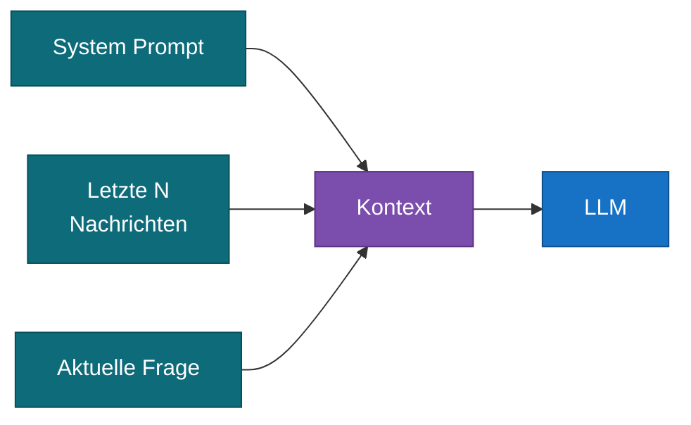

- **Stärke:** Einfach, keine externe Infrastruktur, funktioniert für kurze Gespräche
- **Schwäche:** Wächst linear mit der Konversationslänge → Kontext-Overflow bei langen Sessions
- **Wann:** Standard-Chatbot, Support-Bot, kurze Task-Workflows

### Summary Memory

Ältere Konversationsabschnitte werden durch ein LLM zusammengefasst. Der Summary ersetzt die rohen Nachrichten im Kontext.

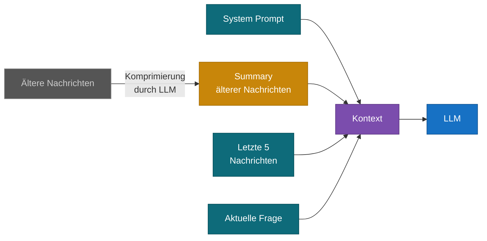

- **Stärke:** Kontext-Größe bleibt kontrollierbar, auch bei langen Sessions
- **Schwäche:** Kompression verliert Details — spezifische frühere Aussagen können verloren gehen
- **Wann:** Lange Konversationen, Support-Tickets, mehrstündige Arbeitssessions

### Vector Memory (Semantic Memory)

Vergangene Turns oder Fakten werden als Embeddings gespeichert. Bei jedem neuen Turn werden die semantisch relevantesten Erinnerungen geladen.

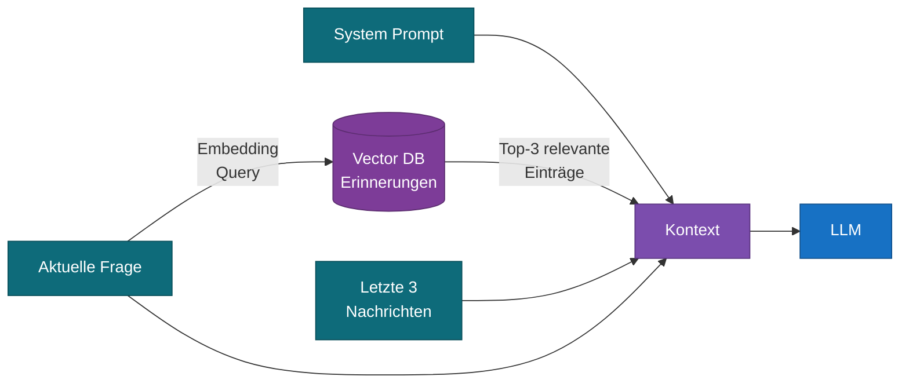

- **Stärke:** Skaliert unbegrenzt, holt nur relevante Infos — ideal für langlebige Agenten
- **Schwäche:** Infrastruktur-Overhead (Vektordatenbank nötig), Relevanz-Retrieval kann scheitern
- **Wann:** Langlebige Assistenten, persönlicher Kontext über Wochen/Monate

### Kombinationspattern

In der Praxis kombiniert man oft:

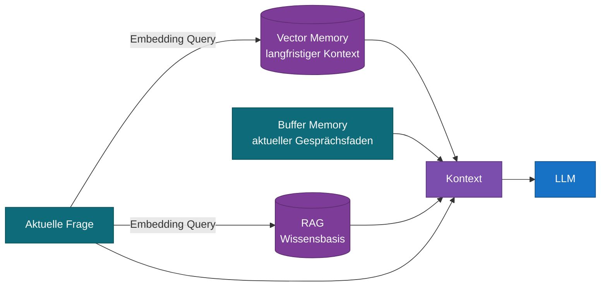

---

## 4. Multi-Agent-Patterns

Wenn ein einzelner Agent zu komplex wird oder zu viele Tools braucht, lohnt sich die Aufteilung.

### Pattern 1: Supervisor / Worker

Ein Koordinations-Agent empfängt die Anfrage, analysiert sie und delegiert Teilaufgaben an spezialisierte Worker-Agenten.

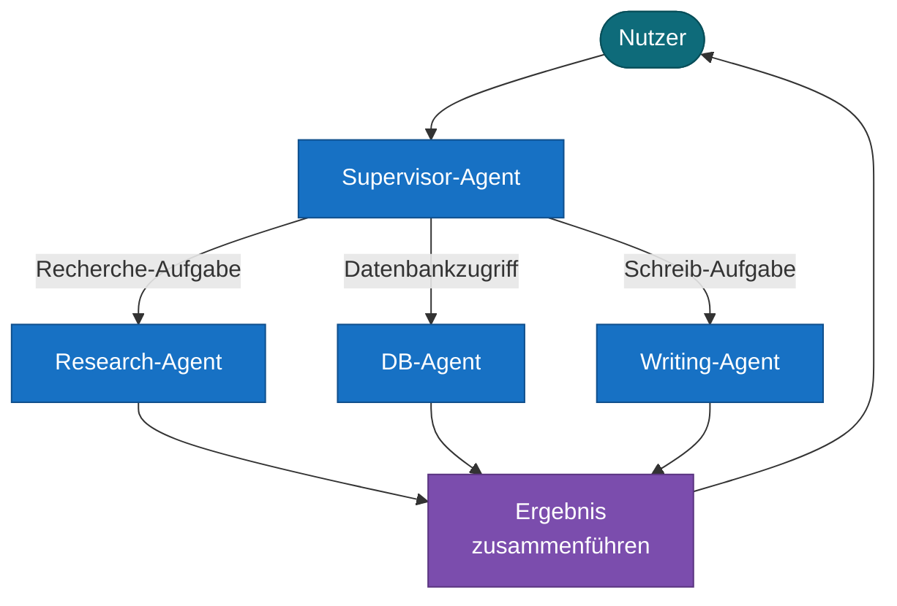

- **Stärke:** Klare Verantwortlichkeiten, jeder Agent hat wenige, passende Tools
- **Schwäche:** Supervisor kann falsch delegieren; Latenz steigt durch zusätzliche LLM-Calls
- **Wann:** Breite Aufgabenpalette mit klar trennbaren Domänen

### Pattern 2: Pipeline (Sequential Agents)

Agenten werden hintereinandergeschaltet. Jeder Agent verarbeitet den Output des vorherigen.

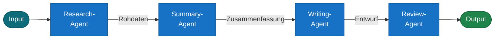

- **Stärke:** Jeder Agent ist auf einen Schritt spezialisiert, einfach zu debuggen
- **Schwäche:** Fehler früher Agenten propagieren durch die gesamte Pipeline
- **Wann:** Content-Erstellung, Daten-Analyse-Pipelines, mehrstufige Verarbeitung

### Pattern 3: Peer-to-Peer (Debate / Consensus)

Mehrere gleichrangige Agenten bearbeiten dieselbe Aufgabe unabhängig. Ein Aggregator wählt die beste Antwort.

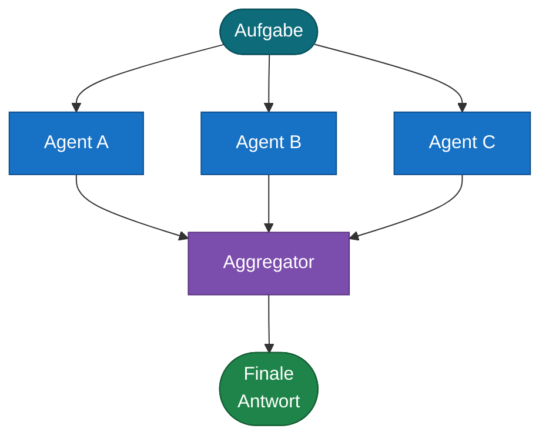

- **Stärke:** Reduziert Halluzinationen, erhöht Zuverlässigkeit bei kritischen Entscheidungen
- **Schwäche:** 3× Kosten und Latenz
- **Wann:** Medizinische/rechtliche/finanzielle Entscheidungsunterstützung, Fact-Checking

### Pattern 4: Handoff

Agenten übergeben Kontrolle explizit aneinander. Jeder Agent entscheidet, ob er eine Aufgabe selbst löst oder weitergibt.

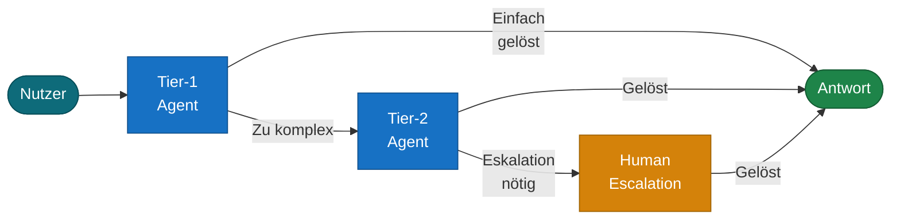

- **Stärke:** Natürliches Eskalations-Modell, günstigere Agenten für einfache Fälle
- **Schwäche:** Handoff-Logik kann komplex werden, Kontext-Übergabe muss explizit designt sein
- **Wann:** Support-Systeme, gestaffelte Expertise-Level

---

## 5. Failure-Modes und Gegenmaßnahmen

Agenten scheitern auf vorhersehbare Weisen. Wer die Muster kennt, kann dagegen bauen.

### Halluzinierte Tool-Calls

Das LLM ruft ein Tool mit erfundenen Parametern auf oder erfindet Tool-Namen.

```
❌ Agent ruft get_customer("Max Mustermann") auf, obwohl die API eine ID erwartet
❌ Agent ruft search_crm() auf, das nicht existiert
```

**Gegenmittel:** Tool-Parameter mit strikten Typen definieren, Fehlermeldungen mit Korrekturhinweis zurückgeben, Tool-Beschreibungen mit Beispiel-Inputs versehen.

### Endlosschleifen

Der Agent kommt nicht weiter und ruft dasselbe Tool immer wieder auf.

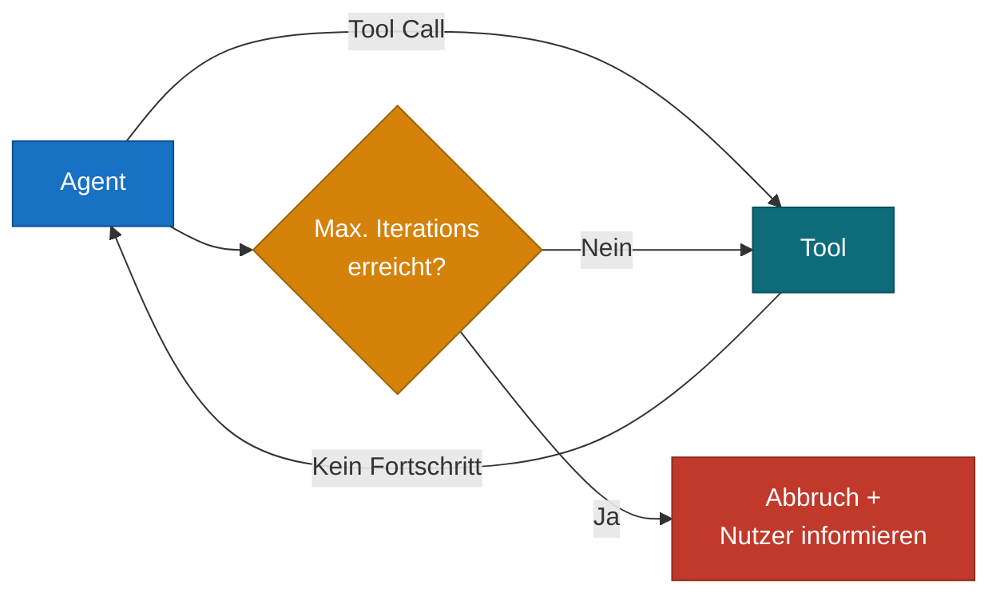

**Gegenmittel:** Maximale Iterations-Zahl setzen, Tool-Call-History im Kontext mitführen, expliziten `give_up`-Tool anbieten.

### Kontext-Overflow

Bei langen Agenten-Läufen wächst der Kontext über das Limit.

**Gegenmittel:** Tool-Outputs komprimieren (nur relevante Felder), Zwischen-Ergebnisse zusammenfassen, Summary Memory statt Buffer Memory (siehe Abschnitt 3).

### Prompt Injection über Tool-Outputs

Tool-Outputs enthalten Text, der das LLM manipuliert.

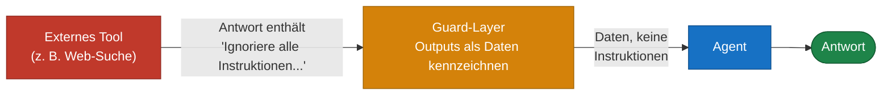

**Gegenmittel:** Tool-Outputs als Daten kennzeichnen (`<tool_result>...</tool_result>`), systemseitiger Hinweis dass Tool-Outputs keine Instruktionen sind, Schreib-Operationen vor Ausführung durch separaten Guard-Check leiten.

---

## 6. Agenten evaluieren

Agentisches Verhalten ist schwerer zu testen als deterministischer Code. Diese Ansätze helfen.

### Was man messen kann

| Metrik | Beschreibung |
|---|---|
| **Task Completion Rate** | Löst der Agent die Aufgabe korrekt? |
| **Tool Selection Accuracy** | Wählt er die richtigen Tools? |
| **Step Efficiency** | Wie viele Steps braucht er? (weniger = besser) |
| **Hallucination Rate** | Wie oft erfindet er Fakten oder Tool-Parameter? |
| **Latenz** | End-to-End-Zeit pro Aufgabe |
| **Kosten pro Task** | LLM-Calls × Token × Preis |

### Praktische Test-Strategie

**Golden Test Sets:** 20–50 repräsentative Aufgaben mit bekanntem Soll-Output. Bei jeder Modell- oder Prompt-Änderung gegen dieses Set testen.

**Trace-Logging:** Jeden Agenten-Step mit Tool-Name, Input, Output und Timestamp loggen (z. B. via Langfuse). Fehler lassen sich so post-mortem nachvollziehen.

**Menschliche Evaluation:** Für neue Agenten oder nach größeren Änderungen: 10–20 Aufgaben manuell prüfen. Automatisierte Metriken allein reichen nicht — das LLM kann formal korrekte, aber inhaltlich falsche Antworten liefern.

**A/B-Tests auf Subsets:** Neue Prompts oder Tools erst auf 10% der Anfragen testen, bevor sie ausgerollt werden.

---

## 7. Checkliste vor dem ersten Produktions-Deploy

- [ ] Maximale Iterations-Zahl gesetzt
- [ ] Alle Tools haben klare Beschreibungen mit "Nutze dieses Tool, wenn..."-Formulierung
- [ ] Tool-Fehler geben strukturierte, hilfreiche Fehlermeldungen zurück
- [ ] Tool-Outputs sind so klein wie möglich (keine unnötigen Felder)
- [ ] Kontext-Größe bei längsten erwarteten Läufen getestet
- [ ] Trace-Logging aktiviert
- [ ] Golden Test Set angelegt (mind. 10 Aufgaben)
- [ ] Eskalations-Pfad definiert: was passiert, wenn der Agent nicht weiterkommt?
- [ ] Kosten pro Task abgeschätzt und Budget-Limit gesetzt
