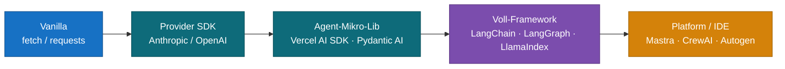

# AI Agent Development – Ökosystem-Übersicht (TS & Python)

Kompakter Wegweiser durch das Framework- und Tool-Ökosystem für die Entwicklung von AI-Agents. Fokus: TypeScript und Python gleichgewichtet, mit Bewertung nach Verbreitung, Community und Produktionsreife (Rock-Solid-Level).

---

## Bewertungs-Schema

Pro Tool werden vier Dimensionen bewertet:

| Symbol | Bedeutung |
| :---- | :---- |
| 🪨 **Rock-Solid** | Produktionserprobt, stabile API, große Codebasis live |
| 🌱 **Stabil** | Reif, aber jüngere Major-Versionen brechen noch APIs |
| ⚡ **Bewegt** | Aktive Entwicklung, häufige Breaking Changes |
| 🧪 **Experimentell** | Spannend, aber nicht für Produktion ohne Vorbehalt |

Verbreitung: 🔵🔵🔵 hoch · 🔵🔵 mittel · 🔵 nischig

---

## 1. Die Stufenleiter: Von Vanilla bis Framework

Die Wahl des Abstraktionsgrades ist die wichtigste Architektur-Entscheidung. Mehr Framework heißt schneller starten, aber weniger Kontrolle und mehr Lock-in.



| Stufe | Zeit-zu-MVP | Kontrolle | Lock-in | Empfehlung für |
| :---- | :---- | :---- | :---- | :---- |
| Vanilla | hoch | maximal | keiner | Lerneffekt, sehr schlanke Services |
| Provider SDK | mittel | hoch | gering | Production-Services mit klarem Scope |
| Mikro-Lib | niedrig | mittel | mittel | Standardfälle ohne Komplexität |
| Voll-Framework | niedrig | mittel | hoch | RAG, Multi-Agent, Komplexes Routing |
| Platform | sehr niedrig | gering | hoch | Schnelle Prototypen, Team ohne Tiefen-Expertise |

---

## 2. Provider SDKs (Layer 2)

Direkter Draht zum Modell-Anbieter. Voll typisiert, schlank, ohne Magie. **Für 80 % aller Production-Use-Cases ist dieser Layer ausreichend.**

| SDK | Sprachen | Status | Verbreitung | Beschreibung |
| :---- | :---- | :---- | :---- | :---- |
| **Anthropic SDK** | TS, Python | 🪨 | 🔵🔵🔵 | Offizielles SDK für Claude-Modelle. Tool Use, Streaming, Files, Computer Use, Citations. Sehr saubere API. |
| **OpenAI SDK** | TS, Python | 🪨 | 🔵🔵🔵 | Referenz-Implementierung für Function Calling, Structured Outputs, Assistants API. |
| **Google GenAI SDK** | TS, Python | 🌱 | 🔵🔵 | Für Gemini-Modelle. Neuer als Konkurrenten, aber stabil. |
| **Mistral SDK** | TS, Python | 🌱 | 🔵 | Schlank, Function Calling solide. |
| **Cohere SDK** | TS, Python | 🌱 | 🔵 | Stärken bei Embeddings und Rerank. |
| **AWS Bedrock SDK** | TS, Python | 🪨 | 🔵🔵 | Multi-Modell-Zugriff (Claude, Llama, Mistral) über AWS-Auth. |
| **Vertex AI SDK** | TS, Python | 🪨 | 🔵🔵 | Googles Bedrock-Äquivalent, oft genutzt von Enterprise mit GCP-Stack. |

**Best Practice:** Wenn du nur ein Modell verwendest, nimm das native SDK. Multi-Provider-Strategien lohnen sich erst, wenn Failover oder Cost-Routing wirklich gebraucht wird.

---

## 3. Mikro-Libs für Agents (Layer 3)

Schlanke Frameworks, die Tool Use, Streaming und Agent-Loops elegant kapseln, ohne ein ganzes Ökosystem mitzubringen.

### TypeScript

| Lib | Status | Verbreitung | Beschreibung |
| :---- | :---- | :---- | :---- |
| **Vercel AI SDK** | 🪨 | 🔵🔵🔵 | De-facto-Standard für TS-Agents. `generateText`, `streamText`, Tool Calling, Multi-Provider. |
| **Mastra** | ⚡ | 🔵🔵 | TS-natives Framework von Gatsby-Gründern. Agents, Workflows, RAG, Memory in einer Lib. |
| **AI SDK Core (`ai`)** | 🪨 | 🔵🔵🔵 | Unterbau des Vercel-SDK, modellagnostisch nutzbar. |

### Python

| Lib | Status | Verbreitung | Beschreibung |
| :---- | :---- | :---- | :---- |
| **Pydantic AI** | 🌱 | 🔵🔵 | Type-safe Agents auf Pydantic-Basis. Fühlt sich wie FastAPI für LLMs an. |
| **Instructor** | 🪨 | 🔵🔵🔵 | Structured Outputs mit Pydantic-Schemas, Multi-Provider. Quasi-Standard für JSON-Extraktion. |
| **DSPy** | 🌱 | 🔵🔵 | Stanford-Projekt. Optimiert Prompts automatisch über Trainingsdaten – eigener Denkansatz. |
| **LiteLLM** | 🪨 | 🔵🔵🔵 | Einheitliches Interface über 100+ Provider hinweg. Oft als Routing-Layer im Stack. |

**Empfehlung TS:** Vercel AI SDK ist die sichere Wahl. **Empfehlung Python:** Instructor für Structured Outputs, Pydantic AI für vollwertige Agents.

---

## 4. Voll-Frameworks (Layer 4)

Bringen Vector Stores, Document Loaders, Chains, Agents, Memory und Observability mit. Schnell produktiv, aber tiefe Lernkurve und API-Bewegung.

| Framework | Sprachen | Status | Verbreitung | Beschreibung |
| :---- | :---- | :---- | :---- | :---- |
| **LangChain** | Python, TS | ⚡ | 🔵🔵🔵 | Größtes Ökosystem, viele Integrations. Python deutlich reifer als TS-Variante. |
| **LangGraph** | Python, TS | 🌱 | 🔵🔵🔵 | LangChain-Subprojekt für stateful Agent-Graphen. Aktuell die empfohlene Wahl für komplexe Agents. |
| **LlamaIndex** | Python, TS | 🪨 | 🔵🔵🔵 | Fokus auf RAG und Daten-Anbindung. Reifer als LangChain für klassisches RAG. |
| **Haystack** | Python | 🪨 | 🔵🔵 | Von deepset, sehr reif, pipeline-orientiert. Enterprise-Fokus. |
| **Semantic Kernel** | Python, C#, Java | 🌱 | 🔵🔵 | Microsofts Framework, stark im .NET-Umfeld. |

**Best Practice für LangChain:** Nicht das volle Framework nutzen, sondern gezielt einzelne Module (`@langchain/core`, einzelne Integrations). Das ist auch der von n8n gewählte Weg.

**LangChain vs. LangGraph:** Klassisches LangChain ist deklarativ („baue mir eine Chain"), LangGraph ist imperativ („definiere einen State-Graphen"). Für alles über Standard-RAG hinaus → LangGraph.

---

## 5. Multi-Agent-Frameworks (Layer 5)

Spezialisiert auf Szenarien mit mehreren kooperierenden Agents.

| Framework | Sprachen | Status | Verbreitung | Beschreibung |
| :---- | :---- | :---- | :---- | :---- |
| **CrewAI** | Python | ⚡ | 🔵🔵🔵 | Rollen-basierte Multi-Agent-Teams. Sehr beliebt für „Agent-Squad"-Setups. |
| **AutoGen** | Python, .NET | ⚡ | 🔵🔵 | Microsoft Research. Conversational Multi-Agent, starkes Code-Generation-Profil. |
| **LangGraph (Multi-Agent)** | Python, TS | 🌱 | 🔵🔵🔵 | Multi-Agent als spezielles Graph-Pattern. Reifer als CrewAI für produktive Setups. |
| **Swarm (OpenAI)** | Python | 🧪 | 🔵🔵 | Experimentell von OpenAI, bewusst minimal. Eher Lehrbeispiel als Produktions-Framework. |

**Empfehlung:** Multi-Agent ist meist überschätzt. Vor einem dieser Frameworks erst klären, ob ein Router-Agent mit spezialisierten Tools nicht reicht (deutlich einfacher zu debuggen).

---

## 6. Vector Stores & RAG-Infrastruktur

Ohne semantische Suche kein RAG. Die Liste ist auf produktionsrelevante Optionen beschränkt.

| Store | Hosting | Status | Verbreitung | Beschreibung |
| :---- | :---- | :---- | :---- | :---- |
| **Qdrant** | Self / Cloud | 🪨 | 🔵🔵🔵 | Rust-basiert, sehr performant. Beliebt für Self-Hosting. |
| **Pinecone** | Cloud | 🪨 | 🔵🔵🔵 | Managed Service, einfachster Einstieg. Teurer als Self-Hosted. |
| **Weaviate** | Self / Cloud | 🪨 | 🔵🔵 | Hybride Suche (Vector + Keyword), reife Multi-Tenant-Features. |
| **PGVector** | Self (Postgres) | 🪨 | 🔵🔵🔵 | Postgres-Extension. Beste Wahl wenn bereits Postgres im Stack. |
| **Chroma** | Self / Cloud | 🌱 | 🔵🔵 | DX-fokussiert, sehr einfach für Prototypen. |
| **Milvus** | Self / Cloud | 🪨 | 🔵🔵 | Enterprise-Scale, komplexer Setup. |
| **Turbopuffer** | Cloud | ⚡ | 🔵 | Object-Storage-basiert, sehr günstig bei großen Datenmengen. |

**Best Practice:** Mit PGVector starten, wenn Postgres ohnehin läuft. Qdrant, wenn dedizierte Vector-DB. Pinecone für Teams, die Managed bevorzugen.

---

## 7. Embedding & Reranking Provider

| Anbieter | Sprache-API | Status | Beschreibung |
| :---- | :---- | :---- | :---- |
| **OpenAI text-embedding-3** | TS, Python | 🪨 | Quasi-Standard, gut und günstig. |
| **Voyage AI** | TS, Python | 🪨 | Aktuell Top-Performance, von Anthropic empfohlen. |
| **Cohere Embed v3** | TS, Python | 🪨 | Sehr stark, mit eigenem Rerank-Modell kombinierbar. |
| **Jina Embeddings** | TS, Python | 🌱 | Multilingual, lange Kontext-Fenster. |
| **Open-Source (BGE, E5, Nomic)** | beide via HF | 🌱 | Self-Hosting möglich, Performance je nach Modell konkurrenzfähig. |
| **Cohere Rerank** | TS, Python | 🪨 | Reranking nach Vector Search, deutlich bessere Trefferqualität. |

**Best Practice:** Vector Search holt Top-50, Rerank reduziert auf Top-5. Dieser zweistufige Ansatz steigert RAG-Qualität signifikant.

---

## 8. Observability & Tracing

Ohne Observability kein produktiver Agent. Mehrere LLM-Calls pro Request, nicht-deterministisches Verhalten – Tracing ist Pflicht.

| Tool | Sprachen | Status | Verbreitung | Beschreibung |
| :---- | :---- | :---- | :---- | :---- |
| **LangSmith** | TS, Python | 🪨 | 🔵🔵🔵 | Von LangChain. Auch ohne LangChain nutzbar. Quasi-Standard. |
| **Langfuse** | TS, Python | 🪨 | 🔵🔵🔵 | Open Source, self-hostbar. Schnell wachsende Alternative zu LangSmith. |
| **Helicone** | TS, Python | 🪨 | 🔵🔵 | Proxy-basiert, sehr einfache Integration über Base-URL-Swap. |
| **Arize Phoenix** | Python (primär) | 🌱 | 🔵🔵 | OSS, OpenTelemetry-basiert, gut für Eval-Integration. |
| **OpenLLMetry** | TS, Python | 🌱 | 🔵 | OpenTelemetry-Standard für LLMs. Vendor-neutral. |
| **Weave (W&B)** | Python | 🌱 | 🔵 | Von Weights & Biases. ML-Background, gut für Eval-Workflows. |

**Best Practice:** Mit Langfuse self-hosted starten, wenn Data-Sovereignty wichtig ist. LangSmith, wenn schnellster Einstieg gewünscht ist.

---

## 9. Evaluation & Testing

Agents sind nicht-deterministisch. Eval ist die Brücke zu „Continuous Delivery" für AI-Workflows.

| Tool | Sprachen | Status | Verbreitung | Beschreibung |
| :---- | :---- | :---- | :---- | :---- |
| **Ragas** | Python | 🪨 | 🔵🔵🔵 | RAG-spezifische Metriken (Faithfulness, Context Precision). Standard für RAG-Eval. |
| **DeepEval** | Python | 🌱 | 🔵🔵 | „Pytest für LLMs". Sehr DX-freundlich. |
| **Braintrust** | TS, Python | 🌱 | 🔵🔵 | Eval + Observability + Prompt-Versionierung. Kommerziell. |
| **LangSmith Evals** | TS, Python | 🪨 | 🔵🔵🔵 | In LangSmith integriert, gut wenn Tracing dort schon läuft. |
| **PromptFoo** | TS (CLI) | 🪨 | 🔵🔵 | CLI-basiert, gut für CI-Integration. |
| **OpenAI Evals** | Python | 🌱 | 🔵🔵 | OSS-Framework von OpenAI, sehr flexibel. |

**Empfehlung:** Für RAG → Ragas. Für Multi-Provider-Comparison → PromptFoo. Für integriertes Eval+Tracing → LangSmith oder Braintrust.

---

## 10. Prompt-Management

Prompts gehören versioniert wie Code. Ab einer gewissen Team-Größe lohnt sich ein eigenes Tool.

| Tool | Status | Beschreibung |
| :---- | :---- | :---- |
| **PromptLayer** | 🪨 | Dediziertes Prompt-Registry mit Versionierung, A/B-Tests. |
| **Langfuse Prompts** | 🪨 | Prompt-Mgmt als Teil von Langfuse, gute Integration. |
| **Latitude** | 🌱 | Open Source, fokussiert auf Prompt-Engineering-Workflow. |
| **Code-as-Truth** | 🪨 | Prompts in Git, mit Code deployen. Simpel, oft ausreichend. |

**Best Practice für kleine Teams:** Prompts als `.md`/`.txt` ins Repo, mit klarer Versionierung über Git. Dedicated Tools erst ab Team-Größe 5+ oder echtem A/B-Testing-Bedarf.

---

## 11. Deployment-Optionen

Wo läuft der Agent in Produktion? Die Antwort hängt stark von Latenz, Skalierung und State ab.

| Option | Stärken | Schwächen | Geeignet für |
| :---- | :---- | :---- | :---- |
| **Vercel / Netlify Functions** | Schnell, gute DX, Edge möglich | Cold Starts, Timeout-Limits | TS-Agents mit kurzer Laufzeit |
| **Cloudflare Workers** | Edge, sehr günstig, schnell | Stark eingeschränktes Runtime-Env | Streaming-Endpoints, Routing |
| **AWS Lambda / Cloud Run** | Skalierung, mature | Mehr Setup | Production-Grade Services |
| **Modal / Replicate** | GPU-Workloads einfach | Vendor-spezifisch | Self-Hosted Modelle, Embeddings |
| **Fly.io / Railway** | Persistent Workloads, Postgres nah | Weniger Auto-Scaling | Stateful Agents mit lokaler DB |
| **LangGraph Platform** | Native Agent-Hosting | Lock-in | Wenn LangGraph der Stack ist |
| **Containerized (K8s)** | Volle Kontrolle | Komplex | Enterprise mit eigenem Platform-Team |

**Best Practice:** Für Streaming-Endpoints → Edge (Cloudflare Workers, Vercel Edge). Für klassische REST-Agents → Cloud Run oder Fly.io. Vermeide Lambda mit kalten Starts für User-facing Latenz.

---

## 12. MCP – Model Context Protocol

Standardisiertes Protokoll von Anthropic für Tool-Server. In 2025/2026 zum De-facto-Standard geworden.

| Komponente | Sprachen | Status | Beschreibung |
| :---- | :---- | :---- | :---- |
| **MCP SDK** | TS, Python, Go, Rust, C#, Kotlin | 🪨 | Offizielle SDKs für Server- und Client-Implementierung. |
| **MCP Server Ecosystem** | viele | 🪨 | Über 200 offizielle und Community-Server (GitHub, Slack, Postgres, etc.). |
| **MCP Clients** | TS, Python | 🪨 | Claude Desktop, Claude Code, Cursor, n8n, LangChain – breit unterstützt. |

**Best Practice:** Eigene Tool-APIs zunehmend als MCP-Server exposen statt als REST. Investition zahlt sich aus, da immer mehr Agent-Plattformen MCP nativ konsumieren.

---

## 13. Empfohlene Stacks (nach Use Case)

### Stack A: TS-Startup, schnelles Time-to-Market

```
Vercel AI SDK + Anthropic SDK
+ PGVector (Supabase)
+ Langfuse self-hosted
+ Vercel Deployment
```

🪨🪨🪨 – Rock-Solid für Standard-Use-Cases.

### Stack B: Python-Enterprise, RAG-fokussiert

```
LangChain Core + Anthropic SDK (kein Voll-LangChain)
+ LlamaIndex für Document-Loading
+ Qdrant self-hosted
+ Ragas + LangSmith
+ Cloud Run Deployment
```

🪨🪨 – Reif und skalierbar.

### Stack C: Multi-Agent, Forschung & Experiment

```
LangGraph (Python)
+ Anthropic SDK
+ Pinecone
+ LangSmith
+ Modal für GPU-Inference
```

🌱🪨 – Cutting-edge, aber API-Bewegung einplanen.

### Stack D: Minimaler Production-Service

```
Vanilla fetch + Anthropic SDK
+ PGVector
+ OpenLLMetry für Tracing
+ Cloudflare Workers
```

🪨🪨🪨 – Maximum Kontrolle, minimaler Lock-in. Für Teams, die jede Abstraktion verstehen wollen.

---

## 14. Faustregeln für die Wahl

1. **Default: ein Layer tiefer als gedacht.** Wenn du an LangChain denkst, prüfe ob Vercel AI SDK / Instructor reicht. Wenn du an Vercel AI SDK denkst, prüfe ob das native Anthropic SDK reicht.
2. **Provider-SDK ist fast immer ausreichend.** Tool Use, Streaming, Structured Output sind dort first-class.
3. **Observability ab Tag 1.** Selbst der einfachste Prototyp braucht Tracing, sobald mehr als ein LLM-Call beteiligt ist.
4. **RAG ≠ Agent.** Klassisches RAG braucht keinen Agent, sondern eine Pipeline mit Retrieval-Schritt. Agent-RAG erst wenn Tool-Wahl wirklich nötig ist.
5. **Eval bevor Skalierung.** Ohne Eval-Pipeline kein „Continuous Delivery" für AI-Features.
6. **MCP-fähig bleiben.** Eigene Tool-Endpoints so designen, dass sie als MCP-Server expose-bar sind.

---

## Anhang: Provider-SDK-Schnellcheck Anthropic

Da im Briefing explizit erwähnt, hier eine 30-Sekunden-Orientierung am Anthropic SDK:

### TypeScript

```bash
npm install @anthropic-ai/sdk
```

```typescript
import Anthropic from "@anthropic-ai/sdk";
const client = new Anthropic();

const msg = await client.messages.create({
  model: "claude-opus-4-7",
  max_tokens: 1024,
  tools: [/* tool definitions */],
  messages: [{ role: "user", content: "Hello" }]
});
```

### Python

```bash
pip install anthropic
```

```python
from anthropic import Anthropic
client = Anthropic()

msg = client.messages.create(
    model="claude-opus-4-7",
    max_tokens=1024,
    tools=[...],
    messages=[{"role": "user", "content": "Hello"}]
)
```

**Was das SDK out-of-the-box mitbringt:** Streaming, Tool Use, Vision, Files API, Citations, Computer Use, automatisches Retry/Backoff, Token-Counting, Batches API. Für die meisten Production-Services ist das die einzige AI-Abhängigkeit, die du brauchst.

---

*Stand: Mai 2026. Bewertungen reflektieren den Markt zum Stichtag; insbesondere die ⚡-eingestuften Tools können sich bis Jahresende deutlich weiterentwickeln. Bei wichtigen Entscheidungen aktuelle Quellen prüfen.*
