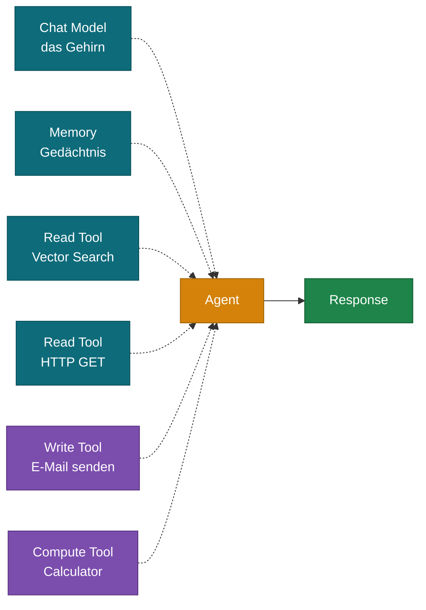
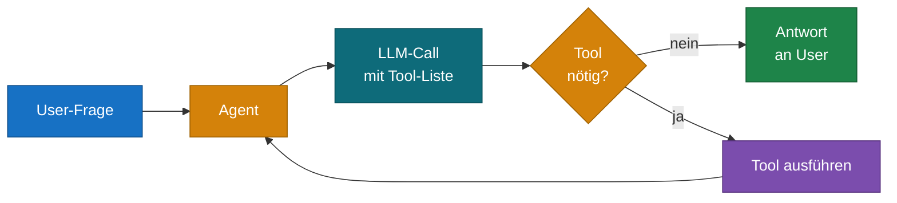
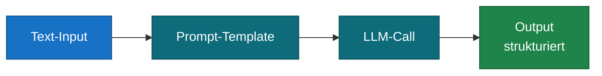
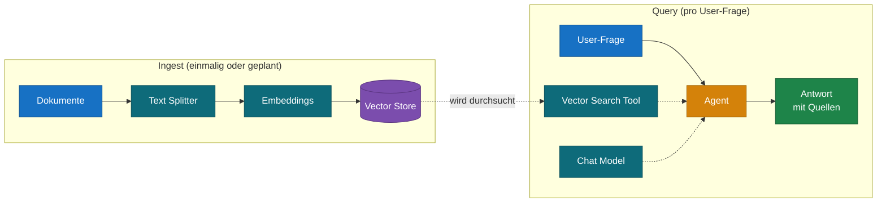
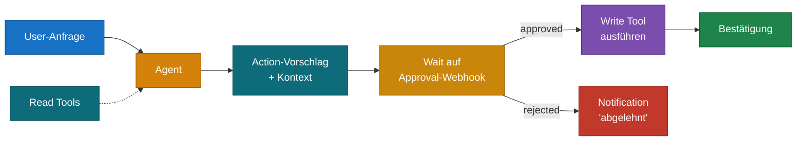
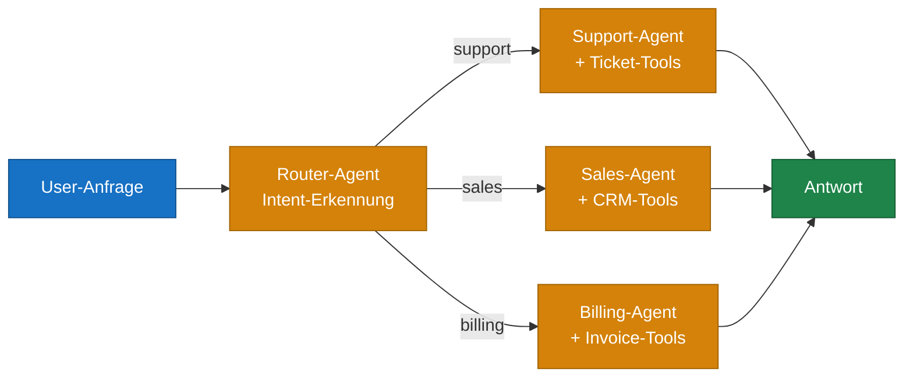
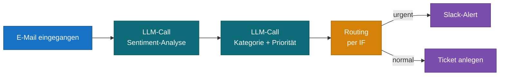
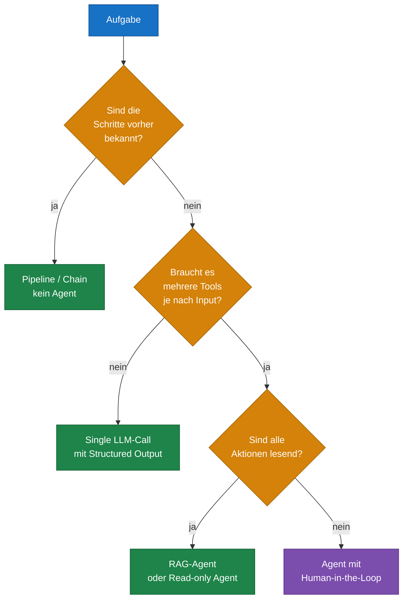

# LLM, Agent & Tools – Einführung und Architektur-Muster

Dieser Guide ist eine konzeptuelle Einführung in moderne AI-Workflows: Was ist ein LLM, was ist ein Agent, was sind Tools – und wie baut man daraus produktionstaugliche Architekturen? Die Beispiele nutzen n8n-Begriffe, die Konzepte gelten aber identisch in LangChain, LangGraph, Vercel AI SDK oder selbstgebauten Agents.

---

## Inhaltsverzeichnis

1. Die drei Bausteine: LLM, Agent, Tools
2. Wie ein Agent denkt – der Reasoning-Loop
3. Memory, Context & State
4. Architektur-Muster (Best Practices)
5. Anti-Patterns – was du vermeiden solltest
6. Do's & Don'ts – Schnellreferenz
7. Wann brauche ich überhaupt einen Agent?

---

## 1. Die drei Bausteine: LLM, Agent, Tools

### 1.1 LLM – Das Gehirn

Ein **Large Language Model** ist im Kern eine Funktion: Text rein, Text raus. Es kann denken, formulieren, kategorisieren, übersetzen, zusammenfassen – aber es kann nichts in der Welt tun. Es hat kein Gedächtnis über einzelne Aufrufe hinaus, keinen Zugriff auf aktuelle Daten, keine Möglichkeit, Aktionen auszulösen.

Ein nacktes LLM ist wie ein extrem belesener Mensch, der in einem fensterlosen Raum sitzt und nur Briefe beantwortet.

### 1.2 Agent – Der Orchestrator

Ein **Agent** ist eine Schicht *um* das LLM herum, die ihm Fähigkeiten verleiht:

- Zugriff auf **Tools**, die das LLM bei Bedarf selbst aufrufen kann
- Ein **Memory**, das sich an frühere Turns erinnert
- Einen **Reasoning-Loop**, der mehrere LLM-Calls hintereinander schaltet, bis ein Ziel erreicht ist

Der Agent ist *kein* LLM. Er ist Code (oder ein Workflow), der das LLM intelligent benutzt.

### 1.3 Tools – Hände, Füße und Sinnesorgane

Ein **Tool** ist alles, was sich als Funktion mit Input und Output beschreiben lässt. Drei Kategorien helfen beim Denken:

| Kategorie | Funktion | Beispiele |
| :---- | :---- | :---- |
| **Read Tools** | Beschaffen Information, verändern nichts | Vektor-DB-Suche, Wikipedia, GET-APIs, SQL SELECT |
| **Write Tools** | Verändern die Welt | E-Mail senden, DB-Insert, Slack-Post, POST/DELETE |
| **Compute Tools** | Lokale Berechnung ohne Seiteneffekt | Calculator, Code-Sandbox, Datums-Funktionen |



Ein **MCP-Server** ist kein eigener Tool-Typ – er ist ein Transport-Protokoll, das mehrere Tools standardisiert bündelt. Ein einzelner MCP-Anschluss kann hinter sich 20 Tools mitbringen.

---

## 2. Wie ein Agent denkt – der Reasoning-Loop

Der Unterschied zwischen einem einfachen LLM-Call und einem echten Agent ist die **Schleife**. Der Agent gibt dem LLM die User-Frage *plus* eine Liste verfügbarer Tools mit deren Beschreibungen. Das LLM antwortet entweder mit Text (fertig) oder mit einem Tool-Call (Aktion gewünscht).



**Beispiel-Verlauf für die Frage „Wie ist das Wetter in Berlin morgen, und soll ich einen Regenschirm einpacken?":**

1. LLM denkt: *Ich brauche das Wetter*. Ruft `get_weather(city='Berlin', date='tomorrow')`.
2. Tool liefert: `{ temp: 12, condition: 'rainy', precipitation: 80% }`.
3. LLM denkt: *Jetzt habe ich genug*. Antwortet: „Morgen wird es regnerisch bei 12°C, nimm einen Regenschirm mit."

Das LLM hat **selbst entschieden**, welches Tool nötig ist und mit welchen Parametern. Das ist der Kern des Agent-Paradigmas.

### 2.1 Was bestimmt die Tool-Wahl?

Drei Dinge:

1. **Der System-Prompt** des Agents (sein „Charakter")
2. **Die Tool-Beschreibungen** – das wichtigste und am häufigsten unterschätzte Element
3. **Das User-Input** des aktuellen Turns

Eine gute Tool-Beschreibung sagt klar: *Was* macht das Tool, *wann* soll es genutzt werden, *welche* Parameter erwartet es. Schlechte Beschreibungen führen dazu, dass das LLM Tools entweder ignoriert oder mit falschen Parametern aufruft.

---

## 3. Memory, Context & State

Es gibt drei verschiedene Arten, wie ein Agent „sich erinnert" – und sie werden gerne verwechselt.

| Typ | Lebensdauer | Beispiel |
| :---- | :---- | :---- |
| **Context Window** | Pro LLM-Call | Was im aktuellen Prompt steht |
| **Conversation Memory** | Pro User-Session | Vorherige Turns im Chat |
| **Long-Term Memory** | Persistent über Sessions | Vector Store, Datenbank, Knowledge Base |

Context Window ist *temporär* – beim nächsten Call ist alles weg, was nicht aktiv mitgegeben wird. Conversation Memory wird vom Agent zwischen Turns automatisch eingefügt. Long-Term Memory ist eine eigene Datenquelle, die der Agent über Read Tools anzapft (typischerweise Vector Search).

**Faustregel:** Conversation Memory ist klein und chronologisch (die letzten 10 Turns). Long-Term Memory ist groß und assoziativ (semantische Suche im Wissensspeicher). Beide haben unterschiedliche Aufgaben und werden nicht gegeneinander ersetzt.

---

## 4. Architektur-Muster (Best Practices)

### 4.1 Pattern: Simple Chain – ohne Agent

Wenn deine Aufgabe **deterministisch** ist und keine Tool-Wahl braucht, ist ein einfacher LLM-Call besser als ein Agent.



**Use Cases:** Zusammenfassung, Übersetzung, Klassifikation, Strukturierung. Vorteile: deterministisch, schnell, billig, gut testbar. **Verwende keinen Agent**, wenn ein simpler LLM-Call reicht – Agents sind teurer und unvorhersehbarer.

### 4.2 Pattern: RAG – Retrieval Augmented Generation

Klassisches Setup für Wissens-Assistenten. Zwei Workflows: einmaliger **Ingest**, kontinuierliche **Query**.



**Best Practice:** Vector Search als **Tool**, nicht als hartverdrahteten Schritt vor dem LLM-Call. Der Agent entscheidet dann selbst, ob er suchen muss (z. B. nicht bei einer reinen Grußformel).

**Empfehlung für Quellen-Tracking:** Jeder Vector-Hit sollte Metadaten (Doc-ID, URL, Seite) mitliefern. Der Agent kann sie dann in der Antwort zitieren – das ist Pflicht für vertrauenswürdige Wissens-Systeme.

### 4.3 Pattern: Human-in-the-Loop für Write Tools

Sobald der Agent **schreibende Aktionen** ausführen soll, gehört ein Approval-Schritt davor – zumindest in produktiven Setups.



**Wann obligatorisch:** Geld bewegen, Mails an Kunden, Daten löschen, irreversible Aktionen. **Wann optional:** interne Notiz schreiben, Log-Eintrag, Test-Slack-Channel.

### 4.4 Pattern: Router – Multi-Agent-Setup

Statt einen großen Agent mit 30 Tools zu bauen, ist es oft sauberer, einen **Router-Agent** mit spezialisierten **Sub-Agents** zu verbinden.



**Vorteile:**
- Jeder Sub-Agent hat fokussiertes Tool-Set → bessere Tool-Wahl
- Spezialisierte System-Prompts pro Domäne
- Sub-Agents einzeln testbar und versionierbar

**Nachteil:** Mehr LLM-Calls (mindestens einer für Routing). Bei Latenz-kritischen Use Cases abwägen.

### 4.5 Pattern: Tool-Pipeline (deterministische Sequenz)

Wenn die Schritte fix sind, brauchst du keinen Agent – baue eine **Pipeline** mit hartverdrahteter Reihenfolge.



**Vorteil gegenüber Agent:** Deterministisch, debugbar, jeder Schritt einzeln pinnbar/testbar. Verwende diesen Pattern, wenn die Schritte vorher feststehen.

---

## 5. Anti-Patterns – was du vermeiden solltest

### 5.1 Agent für deterministische Aufgaben

**Problem:** Ein Agent wird gebaut für „extrahiere Felder aus dieser E-Mail" – obwohl die Felder immer dieselben sind und keine Tool-Entscheidung nötig ist.

**Symptom:** Inkonsistente Outputs, hohe Latenz, hohe Kosten, schlecht testbar.

**Lösung:** Simple Chain mit Structured-Output-Parser (JSON-Schema). Kein Agent nötig.

### 5.2 Tool-Spam

**Problem:** Agent bekommt 25 Tools. Das LLM muss bei jedem Turn die ganze Liste lesen und auswählen.

**Symptome:**
- Latenz steigt (mehr Tokens pro Call)
- Tool-Wahl wird schlechter (LLM verliert den Überblick)
- Halluzinierte Tool-Calls mit erfundenen Parametern

**Lösung:** Maximal 5–10 Tools pro Agent. Bei mehr → Router-Pattern (5.4) oder Sub-Workflows als Bundle-Tools.

### 5.3 Schlechte Tool-Beschreibungen

**Problem:** Tool heißt `get_data` mit Description „Holt Daten". Das LLM weiß nicht, *wann* es das nutzen soll.

**Lösung:** Schreibe Tool-Beschreibungen wie eine Mini-Doku. Beispiel:

```
Tool: search_customer_orders

Description:
Sucht alle Bestellungen eines Kunden im Zeitraum.
NUTZE DIESES TOOL, wenn der User nach vergangenen Bestellungen,
Lieferstatus oder Bestellhistorie fragt.
NICHT NUTZEN für Rechnungs- oder Zahlungsfragen
(dafür: search_invoices).

Parameter:
- customer_id (string, erforderlich): UUID des Kunden
- from_date (ISO date, optional): Startdatum, default 30 Tage zurück
- to_date (ISO date, optional): Enddatum, default heute

Beispiel:
{ customer_id: "abc-123", from_date: "2025-01-01" }
```

Die Großbuchstaben-Direktiven (NUTZE/NICHT NUTZEN) sind kein Quatsch – sie verbessern die Tool-Wahl messbar.

### 5.4 Write Tools ohne Sicherheitsnetz

**Problem:** Agent kann direkt Mails an Kunden senden, ohne Approval. Halluziniert eine falsche Anrede oder einen falschen Vertragstext.

**Lösung:**
- Human-in-the-Loop-Pattern (4.3) für externe Kommunikation
- Schreib-Tools in Test-Channel umleiten während Entwicklung
- Rate-Limits und Daily Caps auf Write Tools (z. B. „max 50 Mails/Tag, dann Notfall-Stop")

### 5.5 Verschachtelte Agents ohne Tiefenlimit

**Problem:** Agent A ruft Agent B als Tool, der ruft Agent C, der ruft wieder A. Endloser Loop, Token-Explosion, Kostenausreißer.

**Lösung:**
- Maximale Rekursionstiefe konfigurieren (`max_iterations` in LangChain, in n8n via Workflow-Settings)
- Klare Verantwortungs-Hierarchie: Router → Sub-Agent → Tools. Kein Sub-Agent ruft den Router.
- Cost-Alerts auf LLM-API-Provider-Ebene

### 5.6 Kein Output-Parsing

**Problem:** Agent gibt freien Text zurück. Folge-System erwartet aber JSON.

**Lösung:**
- Structured-Output-Modus nutzen (OpenAI: `response_format: { type: 'json_schema' }`, Anthropic: Tool-Use mit erzwungenem Schema)
- Output Parser als expliziter Schritt nach dem Agent
- Validierung mit `zod`, `pydantic` o. Ä., bevor der Output in nachgelagerten Prozessen landet

### 5.7 Memory ohne Pruning

**Problem:** Conversation Memory wächst unbegrenzt, irgendwann sprengt es das Context Window.

**Lösung:**
- Window Buffer Memory (letzte N Turns) statt unbegrenztes Memory
- Bei langen Sessions: Summarization Memory – ältere Turns werden zusammengefasst
- Periodisches Reset bei klaren Topic-Wechseln

---

## 6. Do's & Don'ts – Schnellreferenz

### LLM-Calls

**Do**
- Strukturierte Outputs erzwingen, wenn Folge-System darauf angewiesen ist
- Temperature niedrig (0–0.3) für deterministische Tasks, hoch (0.7+) für kreative
- Prompts versionieren (wie Code)
- Mit kleineren/billigeren Modellen anfangen, hochskalieren nur wo nötig

**Don't**
- Freitext zurückgeben und dann mit Regex parsen
- Den gesamten Dialog jedes Mal mitschicken (Memory-Pattern nutzen)
- Sensible Daten in Prompts ohne Audit-Log

### Agents

**Do**
- Klare Rolle/Aufgabe im System-Prompt
- Wenig Tools, gut beschrieben
- `max_iterations` setzen
- Logs/Tracing pro Tool-Call (LangSmith, eigene Logs)
- Eval-Pipeline für typische User-Fragen

**Don't**
- Agent verwenden, wenn eine Chain reicht
- Tools dynamisch zur Laufzeit generieren (schlecht cachebar, schlecht testbar)
- Verschachtelte Agent-Hierarchien ohne Tiefenlimit
- Geschäftslogik in System-Prompts verstecken (gehört in Tools oder Code)

### Tools

**Do**
- Lange, präzise Beschreibungen
- Klare Parameter-Schemas mit Pflicht/Optional-Markierung
- Idempotente Write Tools wo möglich (zweimal aufrufen = gleiches Ergebnis)
- Read Tools cachen, wenn Daten sich selten ändern
- Fehlerausgaben strukturiert zurück ans LLM („not found", „rate limited") – das LLM kann reagieren

**Don't**
- Mehr als ~10 Tools pro Agent
- Tool-Namen wie `tool1`, `do_stuff`
- Write Tools ohne Approval-Mechanismus für externe Aktionen
- Tools, die mehrere unrelated Dinge tun („super_tool")

### Memory & Context

**Do**
- Conversation Memory begrenzen (Window oder Summary)
- Long-Term Memory als Tool exposen, nicht hartverdrahten
- Kontext-Token-Verbrauch monitoren

**Don't**
- Unbegrenztes Memory
- Sensitive Daten in Long-Term Memory ohne Verschlüsselung/TTL
- Memory als Speicher für strukturierte Geschäftsdaten missbrauchen (dafür: echte DB)

---

## 7. Wann brauche ich überhaupt einen Agent?

Das ist die wichtigste Frage – und sie wird zu selten gestellt. Agents sind teurer, unvorhersehbarer und schwerer zu debuggen als Pipelines. Sie lohnen sich nur, wenn ihre Stärke gebraucht wird: **autonome Entscheidungen zur Laufzeit**.



**Goldene Regel:** Beginne mit der einfachsten Architektur, die das Problem löst. Eskaliere zu Agents nur, wenn die Aufgabe wirklich Entscheidungsfreiheit braucht. Ein Großteil produktiver AI-Workflows sind Pipelines mit ein bis drei LLM-Calls – keine Agents.

---

## Anhang: Glossar

| Begriff | Bedeutung |
| :---- | :---- |
| **LLM** | Large Language Model – Sprachmodell wie Claude, GPT, Llama |
| **Agent** | Code/Workflow, der ein LLM mit Tools und Memory orchestriert |
| **Tool** | Funktion mit Input/Output, die der Agent aufrufen kann |
| **Tool Use / Function Calling** | Protokoll, mit dem das LLM strukturiert Tool-Aufrufe anfordert |
| **MCP** | Model Context Protocol – standardisierter Tool-Server |
| **RAG** | Retrieval Augmented Generation – LLM-Antwort mit Wissensabruf |
| **Embedding** | Vektor-Repräsentation eines Texts für semantische Suche |
| **Vector Store** | Datenbank für Embeddings, ermöglicht Ähnlichkeitssuche |
| **Context Window** | Maximale Token-Menge pro LLM-Call |
| **System Prompt** | Anweisungen, die das Verhalten des LLM/Agents prägen |
| **Chain** | Sequenz von LLM-Calls, deterministisch verknüpft |
| **Human-in-the-Loop** | Architektur mit menschlichem Freigabe-Schritt |

---

*Stand: Mai 2026. Konzepte gelten plattformunabhängig; Beispiele und Mermaid-Farben folgen dem n8n-Kompendium.*
