# n8n Datenfluss & Kontrollstrukturen – Das Master-Kompendium (v2)

Dieses Kompendium ist das vollständige Nachschlagewerk für alle Kontroll- und Datenfluss-Nodes in n8n. Es erklärt das Datenmodell, wie Daten durch Workflows fließen, wie Weichen gestellt werden, wie Items geformt werden, wie Sub-Workflows orchestriert werden und wie Fehler visuell abgefangen werden. Praxisnahe Metaphern und Mermaid-Diagramme machen die Konzepte greifbar.

---

## Inhaltsverzeichnis

1. Das n8n-Datenmodell
2. Ausführungsmodell & Branching-Semantik
3. Logische Kontroll-Nodes (Weichensteller)
4. Zeit- & Orchestrierungs-Nodes
5. Datenform-Nodes (Item-Shaping)
6. Zusammenführung & Schleifen
7. Der Code-Node (Joker)
8. Fehlerkontrollstrukturen
9. Cheat-Sheet: Welcher Node wofür?

---

## 1. Das n8n-Datenmodell

Bevor die einzelnen Nodes betrachtet werden, muss das fundamentale Prinzip von n8n sitzen: Die Engine verliert ihre Historie nicht, während ein Workflow von links nach rechts läuft.

### 1.1 Data Context (Der historische Speicher)

Während der Ausführung hält n8n alle Daten aller vorherigen Schritte im Speicher. Ein Node greift standardmäßig auf den direkten Vorgänger zu, kann aber über Expressions jederzeit auf ältere Nodes referenzieren, ohne dass Daten mühsam durchgeschleift werden müssen.

```javascript
// Zugriff auf historische Nodes:
{{ $node["Node_Name"].json.feld_name }}

// Moderne Schreibweise (empfohlen):
{{ $('Node_Name').item.json.feld_name }}

// Alle Items eines vorherigen Nodes:
{{ $('Node_Name').all() }}

// Statische Daten (persistent zwischen Workflow-Runs):
{{ $workflow.staticData.cursor }}
```

### 1.2 Items, Arrays und Item-Matching

n8n verarbeitet Daten als **Arrays von Items**. Jedes Item ist ein Objekt mit (mindestens) einem `json`-Feld und optional einem `binary`-Feld.

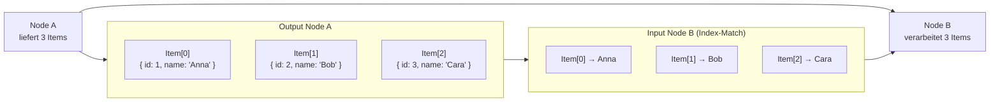

**Wichtig:** Wenn ein Node auf Daten eines vorherigen Schrittes zugreift, matcht n8n diese standardmäßig über den **Index** (Position im Array). Verändert ein Node die Anzahl oder Reihenfolge der Items, muss bei komplexen Verknüpfungen auf eindeutige IDs (z. B. via Merge-Combine) zurückgegriffen werden.

### 1.3 Fixed Values vs. Expressions

Jedes Eingabefeld in n8n hat zwei Modi:

| Modus | Erkennbar an | Bedeutung |
| :---- | :---- | :---- |
| **Fixed** | Grauer Text | Statischer Wert, immer gleich |
| **Expression** | `={{ ... }}` in grün/türkis | Dynamisch, wird je Item neu ausgewertet |

Expressions sind JavaScript-Snippets in doppelten geschweiften Klammern und können auf `$json`, `$node`, `$workflow`, `$now`, `$itemIndex` u. v. m. zugreifen.

### 1.4 Pinned Data (Entwicklungs-Konzept)

Während der Entwicklung kann der Output eines Nodes „angeheftet" werden (Pin). Folgeläufe nutzen dann diese fixierten Daten anstatt den Node neu auszuführen – praktisch beim Debuggen oder wenn der Quell-Service Rate-Limits hat.

---

## 2. Ausführungsmodell & Branching-Semantik

Ein verbreitetes Missverständnis: Parallele Branches in n8n laufen **nicht echt parallel**, sondern werden sequenziell abgearbeitet (Branch-für-Branch, in Reihenfolge der Verbindungen). Das ist relevant, sobald Branches Seiteneffekte haben (Daten schreiben, Counter erhöhen).

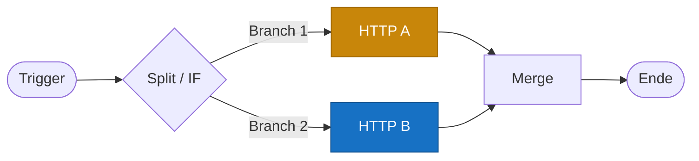

**Reihenfolge in n8n:** Erst läuft Branch 1 (gelb) komplett durch, dann Branch 2 (blau). Erst danach wird `Merge` ausgeführt.

### 2.1 „Run Once for All Items" vs. „Run Once for Each Item"

Viele Nodes (besonders Code, HTTP Request) erlauben zwei Ausführungsmodi:

| Modus | Verhalten | Wann nutzen? |
| :---- | :---- | :---- |
| **Run Once for All Items** | Node läuft genau einmal mit dem gesamten Item-Array | Aggregierte Logik, Batch-Operationen, Code mit `items.map()` |
| **Run Once for Each Item** | Node läuft N-mal, einmal pro Item | Einzel-API-Calls, pro Item dynamische Konfiguration |

Dieser Schalter verändert das Verhalten fundamental – im Code-Node bestimmt er sogar, ob `items` (Array) oder `item` (einzeln) verfügbar ist.

---

## 3. Logische Kontroll-Nodes (Die Weichensteller)

Diese Nodes steuern visuell, welchen Weg die Daten im Workflow einschlagen.

### 3.1 IF-Node (Die binäre Weiche)

**Metapher:** Eine Weggabelung mit Schild „Nur für Mitglieder". Wer die Bedingung erfüllt, geht links (true), alle anderen rechts (false).

Der IF-Node teilt den Datenstrom basierend auf Bedingungen (z. B. `status === 'aktiv'`) auf. **Jedes Item wird einzeln geprüft**, sodass ein Teil der Daten im True-Zweig und ein Teil im False-Zweig landen kann.

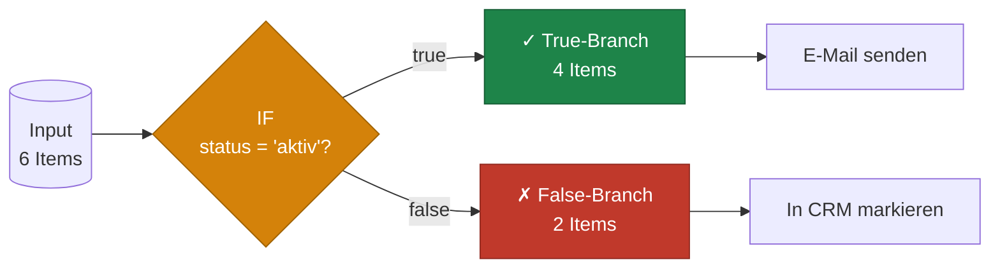

### 3.2 Switch-Node (Der Multi-Weichensteller)

**Metapher:** Ein Postbote am Sortiertisch. Er sieht sich die Postleitzahl an und wirft den Brief in eine von zehn Kisten (Berlin, Paris, Madrid …).

Wenn ein einfaches Ja/Nein nicht ausreicht, leitet der Switch-Node Daten anhand von exakten Werten, Regex oder Expressions an eine **unbegrenzte Anzahl Ausgänge** weiter. Optional gibt es einen **Fallback-Ausgang** für Items, die zu keiner Regel passen.

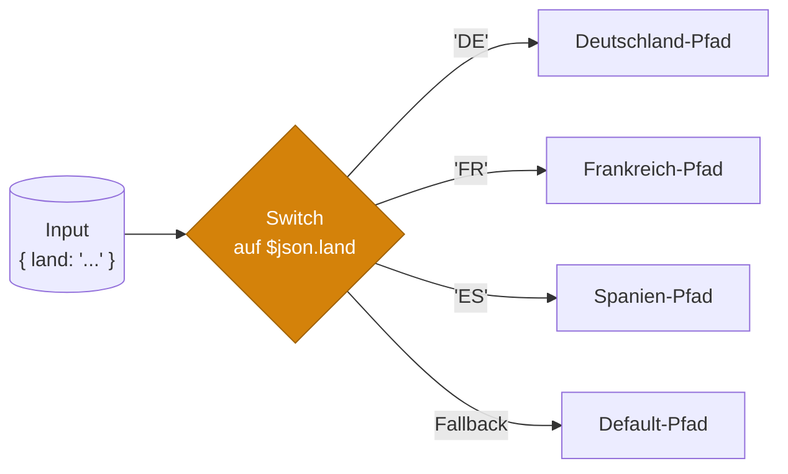

### 3.3 Filter-Node (Der Türsteher)

**Metapher:** Club-Türsteher. Wer auf der Gästeliste steht, darf passieren. Alle anderen müssen heim.

Im Gegensatz zum IF-Node teilt der Filter-Node den Datenstrom nicht auf, sondern sortiert unerwünschte Items rigoros aus. Nur ein einziger Ausgang – aber mit weniger Items als am Eingang.

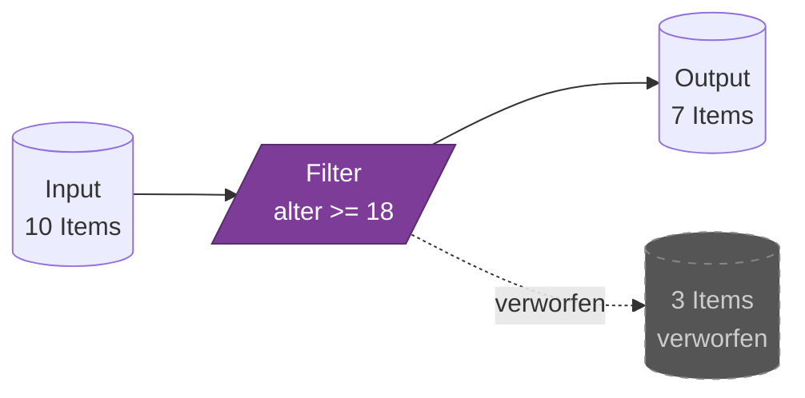

---

## 4. Zeit- & Orchestrierungs-Nodes

### 4.1 Wait-Node (Die Pause-Taste)

**Metapher:** Eine Sanduhr, die den Workflow anhält, bis ihre Zeit abgelaufen ist – oder bis jemand draußen klopft.

Der Wait-Node pausiert die Ausführung. Drei wichtige Modi:

| Modus | Verhalten |
| :---- | :---- |
| **After Time Interval** | Pausiert N Sekunden/Minuten/Stunden |
| **At Specified Time** | Wartet bis zu einem absoluten Datum/Zeitpunkt |
| **On Webhook Call** | Pausiert bis ein externer Service einen Resume-Webhook aufruft |

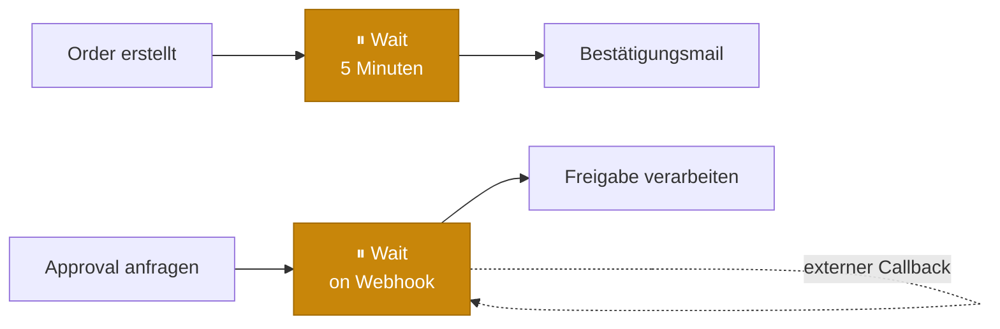

Der Webhook-Modus ist mächtig: Hier kann z. B. ein Mensch in einer externen UI „Genehmigen" klicken, und der wartende Workflow setzt sich fort.

### 4.2 Execute Workflow (Sub-Workflow-Aufruf)

**Metapher:** Ein Funktionsaufruf in der Visual-Welt. Wie wenn ein Restaurant einen externen Caterer beauftragt: Bestellung rein, fertiges Gericht raus.

Der Execute-Workflow-Node ruft einen anderen Workflow als „Funktion" auf. Der gerufene Workflow startet mit einem **Execute Workflow Trigger** und gibt seine letzten Daten zurück.

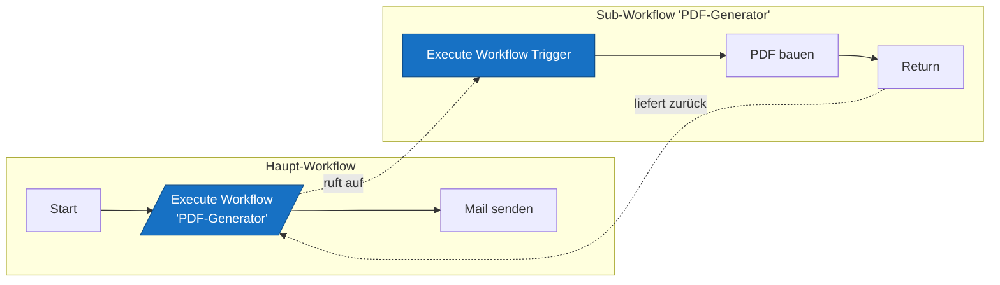

**Wann nutzen?**
- Wiederverwendbare Logik (z. B. „Kunde anlegen" als Sub-Workflow)
- Übersichtlichkeit bei großen Workflows
- Unterschiedliche Berechtigungen / Owner pro Workflow

### 4.3 Stop and Error-Node (Aktiv abbrechen)

**Metapher:** Die Notbremse im Zug. Der Workflow wirft bewusst einen Fehler – nützlich, wenn eine Geschäftsregel verletzt wird und der Error Trigger das aufgreifen soll.

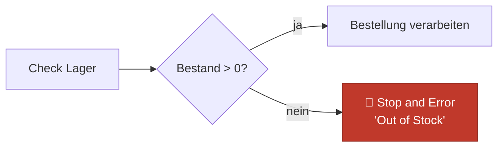

---

## 5. Datenform-Nodes (Item-Shaping)

Diese Nodes verändern die Form der Items, ohne den Workflow zu verzweigen. Sie sind die Brücke zwischen API-Outputs und dem, was nachfolgende Nodes erwarten.

### 5.1 Edit Fields (Set) – Der Schneider

**Metapher:** Schneider, der einen Anzug auf Maß umarbeitet: Felder anlegen, umbenennen, abschneiden.

Setzt, ändert oder entfernt Felder pro Item. Ideal, um API-Antworten in ein einheitliches Schema zu normalisieren oder konstante Werte (z. B. `source: 'webhook'`) anzureichern.

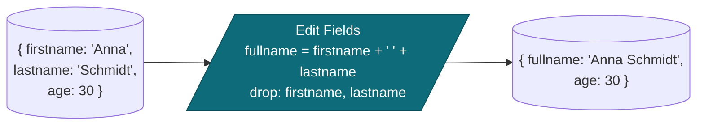

### 5.2 Split Out – Das Auspacken

**Metapher:** Eine Versandkiste, in der 5 Pakete liegen, wird ausgepackt – aus 1 Item werden 5 Items.

Zerlegt ein Array-Feld innerhalb eines Items in mehrere Items. **Achtung:** wird oft mit dem Loop-Node verwechselt – Split Out ist aber kein Schleifen-Konstrukt, sondern reine Item-Multiplikation.

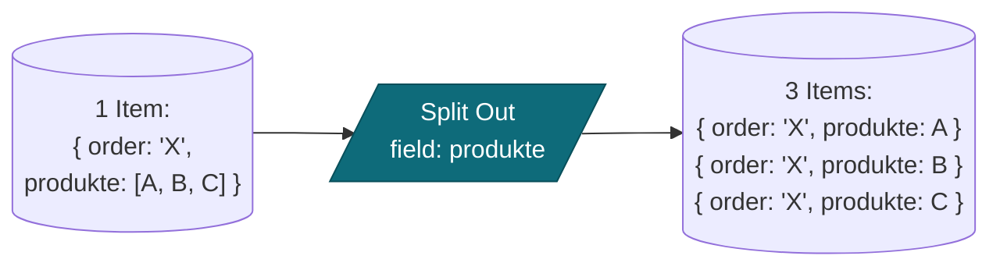

### 5.3 Aggregate – Das Einpacken

**Metapher:** Das Gegenstück zu Split Out: 100 Items werden in eine einzige Kiste gepackt.

Fasst alle eingehenden Items zu **einem** Item zusammen, dessen Felder Arrays enthalten. Praktisch vor einem Batch-Endpoint, der eine Liste von IDs erwartet.

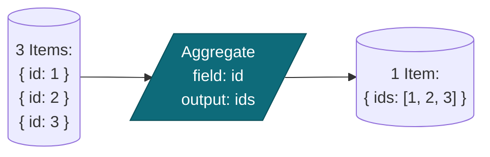

---

## 6. Zusammenführung & Schleifen

### 6.1 Merge-Node (Das Logistik-Zentrum)

Wenn Daten aus verschiedenen Quellen zusammengeführt oder nach einer Verzweigung wieder vereint werden sollen, kommt der Merge-Node zum Einsatz. Er bietet vier fundamentale Modi:

| Modus | Funktionsweise | Typischer Anwendungsfall |
| :---- | :---- | :---- |
| **Append** | Hängt Items von Input 2 unten an Input 1 an. | Zwei Kontaktlisten zu einer Gesamtliste kombinieren. |
| **Combine** | Verknüpft Items über eine gemeinsame Eigenschaft (z. B. ID). | Kunden-ID mit Bestelldaten anreichern. |
| **Choose Branch** | Wartet, bis Daten ankommen, und reicht einen ausgewählten Strom weiter. | Workflow nach Weiche fortsetzen, egal welcher Pfad zog. |
| **Multiplex** | Mathematisches Kreuzprodukt: jedes Item ×  jedes Item. | 5 Berichte × 3 Empfänger = 15 Kombinationen. |

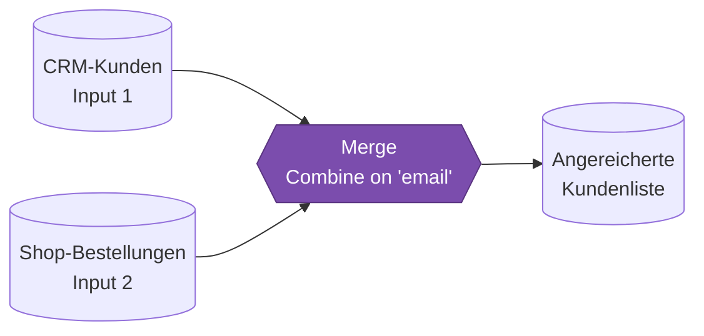

### 6.2 Loop Over Items (Das Fließband)

**Metapher:** Eine Fabrikmaschine, die Bauteile nicht kistenweise, sondern einzeln nacheinander auf das Fließband legt, weil die Verpackungsstation nur ein Teil pro Sekunde verarbeitet.

Standardmäßig verarbeitet n8n Daten im Block (Bulk). Der Loop-Node bricht dies auf und gibt Daten in fest definierten Portionsgrößen (z. B. immer genau 1 Item) in eine Schleife. Essenziell für API-Limits oder Pagination.

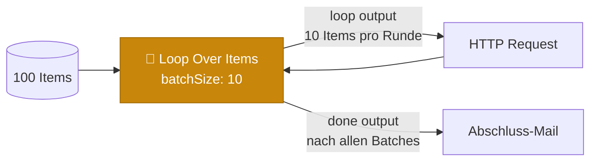

**Zwei Ausgänge:**
- **loop:** läuft pro Batch in die Verarbeitung und kehrt zurück
- **done:** wird nach Abarbeitung aller Items genau einmal ausgelöst

---

## 7. Der Code-Node (Joker)

Wenn die visuellen Nodes an ihre Grenzen stoßen, erlaubt der Code-Node natives JavaScript oder Python. Komplexe Datenmanipulationen, tiefe Verschachtelungen oder mathematische Berechnungen sind hier möglich.

```javascript
// Run Once for All Items – Modus
// $input.all() liefert das komplette Array
const items = $input.all();

const enriched = items.map(item => ({
  json: {
    ...item.json,
    fullname: `${item.json.firstname} ${item.json.lastname}`,
    processed_at: new Date().toISOString()
  }
}));

return enriched;
```

```javascript
// Run Once for Each Item – Modus
// $json ist das aktuelle Item
return {
  json: {
    ...$json,
    fullname: `${$json.firstname} ${$json.lastname}`
  }
};
```

**Faustregel:** Wenn drei oder mehr Edit-Fields/IF-Nodes hintereinander hängen, lohnt sich ein Code-Node. Wenn das Team aber kein JavaScript pflegen möchte, bleibt der visuelle Weg lesbarer.

---

## 8. Fehlerkontrollstrukturen

Fehlermanagement wird in n8n direkt über die UI gelöst – klassischer Try/Catch-Code ist in den meisten Fällen überflüssig.

### 8.1 Retry On Failure (Wiederholungs-Logik)

In den Node-Settings konfigurierbar:

| Parameter | Bedeutung |
| :---- | :---- |
| **Max Tries** | Maximale Anzahl Versuche (z. B. 3) |
| **Wait Between Tries (ms)** | Wartezeit zwischen Versuchen |

Bei temporärem API-Ausfall versucht der Node die Ausführung automatisch erneut, bevor er final fehlschlägt.

### 8.2 On Error (Visuelles Catch-Verhalten)

| Einstellung | Verhalten bei Fehler | Programmier-Äquivalent |
| :---- | :---- | :---- |
| **Stop Workflow** | Workflow bricht sofort ab und wird rot. | `throw new Error()` |
| **Continue (Regular Output)** | Fehler wird ignoriert, leere Daten fließen weiter. | `try { } catch { /* ignore */ }` |
| **Continue (Error Output)** | Item fließt weiter, erhält aber ein `error`-Objekt. | `catch (err) { return { error: err } }` |

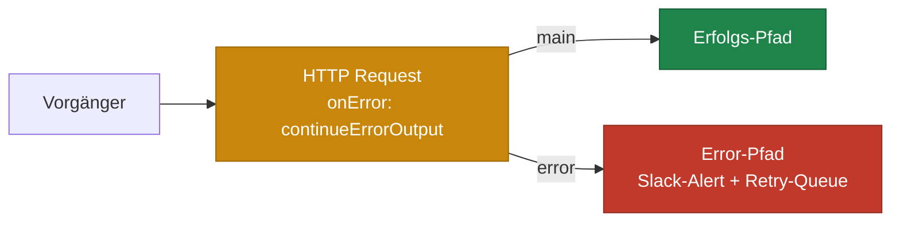

### 8.3 Globaler Error Trigger

Ein eigenständiger Workflow, der mit einem **Error Trigger-Node** startet. Sobald irgendein Workflow im n8n-System abstürzt, fängt dieser Trigger den Fehler ab. Er liefert Metadaten (Workflow-Name, ID, fehlerhafter Node), um automatisierte Benachrichtigungen per Resend, Slack oder Matrix anzustoßen.

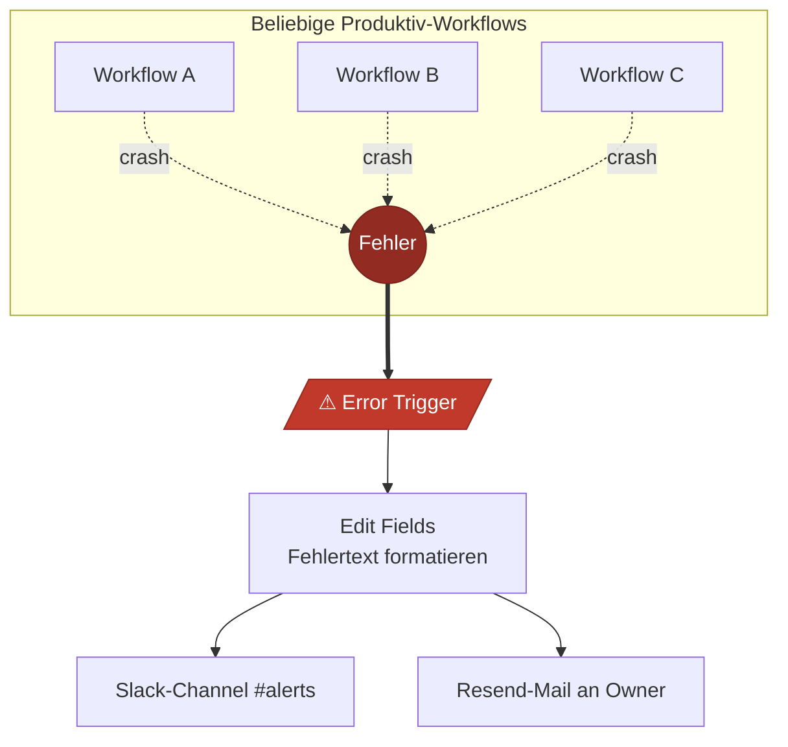

Empfehlung: **immer einen Error-Workflow betreiben** und in den Workflow-Settings als Default-Error-Workflow eintragen.

---

## 9. Cheat-Sheet: Welcher Node wofür?

| Aufgabe | Node |
| :---- | :---- |
| „Ja/Nein"-Entscheidung pro Item | **IF** |
| Verteilung auf 3+ Pfade nach Wert | **Switch** |
| Items aussortieren ohne Verzweigung | **Filter** |
| Workflow zeitlich pausieren / auf Callback warten | **Wait** |
| Wiederverwendbare Logik kapseln | **Execute Workflow** |
| Workflow gezielt mit Fehler beenden | **Stop and Error** |
| Felder umbenennen, hinzufügen, entfernen | **Edit Fields (Set)** |
| Array in einzelne Items aufsplitten | **Split Out** |
| Viele Items zu einem Array-Item zusammenfassen | **Aggregate** |
| Zwei Datenströme verbinden | **Merge** |
| In Batches durch eine Liste iterieren | **Loop Over Items** |
| Beliebige Custom-Logik | **Code** |
| Einzelnen Node-Fehler tolerieren | **On Error: Continue (Error Output)** |
| Systemweites Fehler-Monitoring | **Error Trigger (eigener Workflow)** |

---

*Stand: Mai 2026. Bezieht sich auf n8n ab Version 1.x mit dem aktuellen Node-Set (IF v2, Switch v3, Loop Over Items, Edit Fields/Set v3, Split Out, Aggregate).*
