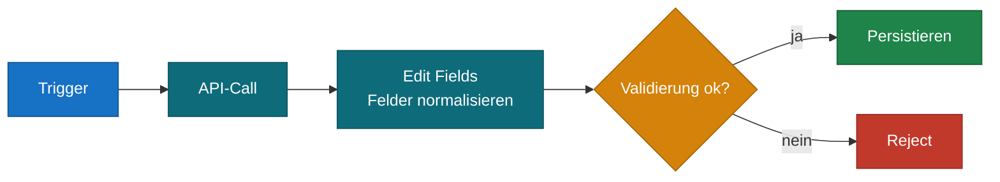
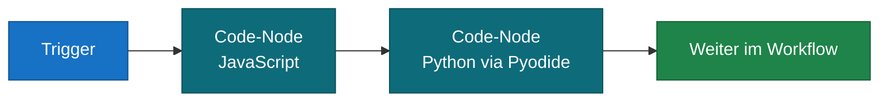
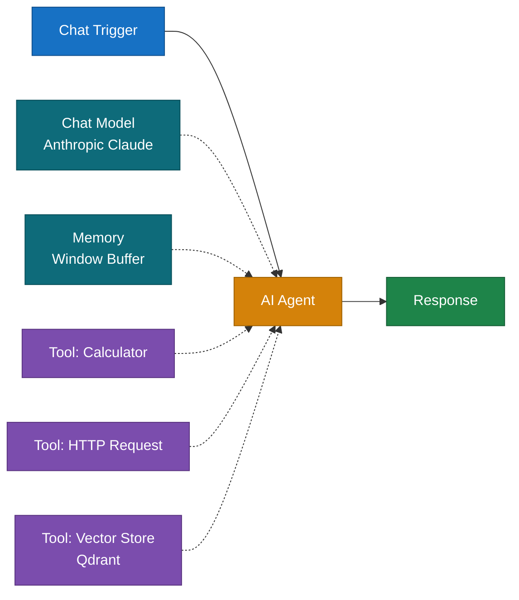
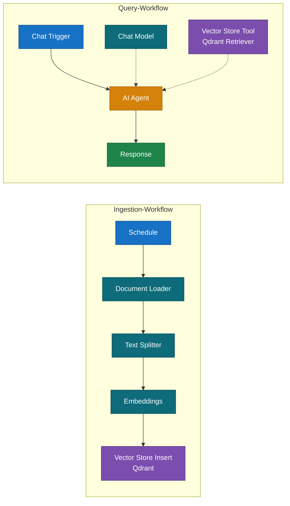
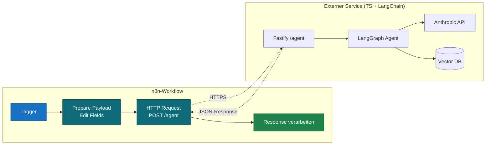
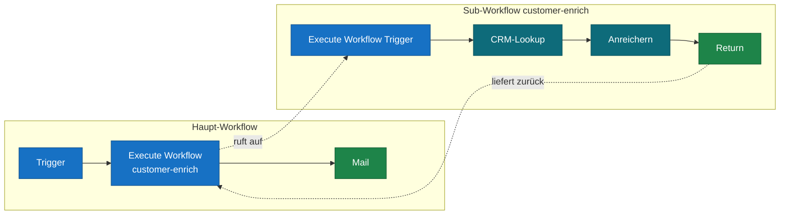
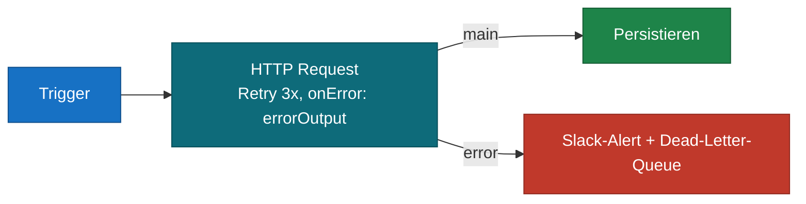
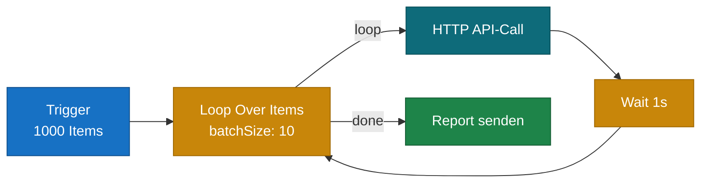
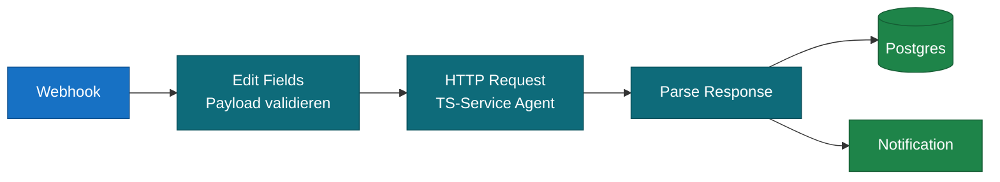

# n8n für Entwickler – Praktischer Einstieg in Code, AI & Custom Logic

Dieser Guide richtet sich an Entwickler, die n8n als Orchestrierungs-Layer einsetzen wollen und wissen müssen: **Was kann ich im Code-Node tun, was ist der schnellste Weg zu AI-Workflows, und wann verlasse ich n8n besser nach außen in einen TS-Service?** Alle Diagramme folgen dem gemeinsamen Farbschema des Kompendiums.

---

## Inhaltsverzeichnis

1. Mental Model: n8n aus Entwickler-Sicht
2. Der Code-Node in der Tiefe
3. AI-Nodes & LangChain-Ökosystem
4. Erweiterungs-Strategien (Custom Node, externer Service)
5. Entscheidungsmatrix: Wo soll Logik leben?
6. Patterns aus der Praxis

---

## 1. Mental Model: n8n aus Entwickler-Sicht

Wer aus klassischer Backend-Entwicklung kommt, sollte n8n nicht als Low-Code-Tool, sondern als **visuellen Orchestrator über JSON-Items** verstehen. Drei Konzepte reichen für den Einstieg:

- **Items** sind Objekte mit `{ json, binary }`. Jeder Node bekommt ein Array, gibt ein Array zurück.
- **Index-Matching** verknüpft Items über ihre Position, nicht über IDs (außer bei Merge-Combine).
- **Expressions** (`{{ ... }}`) sind kleine JS-Snippets pro Feld – die schnellste Form von Logik, ohne Code-Node.



Faustregel: Wenn dein Workflow primär **„Daten von A nach B mit Validierung dazwischen"** ist, sind die nativen Nodes fast immer schneller geschrieben als jeder Custom-Code. Code-Nodes kommen erst ins Spiel, wenn die Transformation komplexer wird oder eine Lib-Funktion gebraucht wird.

---

## 2. Der Code-Node in der Tiefe

### 2.1 Sprache: JS oder Python – nicht beides

Beim Anlegen wählst du **eine** Sprache pro Node. Brauchst du beides, hängst du zwei Code-Nodes hintereinander.



| Sprache | Runtime | Stärke | Schwäche |
| :---- | :---- | :---- | :---- |
| **JavaScript** | V8-Isolate (Cloud) / `vm2` (self-hosted) | Schnell, voller n8n-Internals-Zugriff, viel Community-Code | Kein TypeScript, kein Bundler |
| **Python** | Pyodide (WASM) | Vertraute Syntax für Data-People | Eingeschränkte Stdlib, kein `requests`, langsamer Start, kein Pip in Cloud |

**Faustregel:** JS als Default. Python nur, wenn eine spezifische Lib (z. B. `numpy`-Berechnung) den Ausschlag gibt.

### 2.2 TypeScript geht *nicht* – aber JSDoc

Der Code-Node hat keinen Compile-Schritt. Type-Annotations, `interface`, `as`-Casts kennt der Parser nicht. **Workaround:** JSDoc-Kommentare. Pure JS-Syntax, aber der eingebaute Monaco-Editor in n8n zeigt Typen und Autocomplete.

```javascript
/**
 * @typedef {Object} Customer
 * @property {number} id
 * @property {string} name
 * @property {string} [email]
 */

/** @type {Customer[]} */
const customers = $input.all().map(i => i.json);

return customers
  .filter(c => c.email)
  .map(c => ({ json: { ...c, processed: true } }));
```

### 2.3 Ausführungsmodi: Item-Modus verändert die API

```javascript
// Run Once for All Items
// $input.all() → Item-Array, du gibst Array zurück
const items = $input.all();
return items.map(item => ({
  json: { ...item.json, doubled: item.json.value * 2 }
}));

// Run Once for Each Item
// $json ist das aktuelle Item, du gibst ein einzelnes Item zurück
return {
  json: { ...$json, doubled: $json.value * 2 }
};
```

Der Modus-Schalter sitzt direkt unter dem Sprach-Dropdown. **Default ist „All Items"** – das ist fast immer der richtige Modus, weil schneller (ein Aufruf statt N).

### 2.4 Verfügbare Variablen im JS-Code-Node

| Variable | Bedeutung |
| :---- | :---- |
| `$input.all()` | Array aller Input-Items |
| `$input.first()` / `.last()` | Erstes/letztes Item |
| `$json` | Aktuelles Item (nur im Each-Modus) |
| `$node["Name"]` / `$('Name')` | Zugriff auf historische Nodes |
| `$workflow` | Workflow-Metadaten (`id`, `name`, `active`) |
| `$workflow.staticData` | Persistenter Speicher zwischen Runs |
| `$now`, `$today` | Luxon-DateTime-Instanzen |
| `$itemIndex` | Index des aktuellen Items |
| `$execution.id` | ID des aktuellen Runs |
| `crypto`, `DateTime` (Luxon) | Eingebaute Libs |

### 2.5 External Modules

**n8n Cloud:** harte Allowlist, `require()` schlägt für die meisten Module fehl. Lebe mit den Built-ins.

**Self-hosted:** über ENV-Variablen erweiterbar.

```bash
# Erlaubt npm-Module im JS-Code-Node
NODE_FUNCTION_ALLOW_EXTERNAL=lodash,date-fns,uuid

# Erlaubt eingebaute Node.js-Module
NODE_FUNCTION_ALLOW_BUILTIN=crypto,url,querystring
```

Nach Restart sind die Module per `const _ = require('lodash');` nutzbar. Vorsicht beim Audit: Du öffnest damit deine Sandbox.

### 2.6 HTTP aus dem Code-Node

Kann man machen (in JS via `this.helpers.httpRequest({...})`), **sollte man aber meist nicht.** Der separate HTTP-Request-Node ist beobachtbar, retry-fähig, hat eingebautes Auth-Handling und lässt sich pinnen. Code-Node → HTTP-Request-Node → Code-Node ist fast immer das sauberere Pattern.

---

## 3. AI-Nodes & LangChain-Ökosystem

### 3.1 Was steckt im Paket `@n8n/n8n-nodes-langchain`?

Wer das in Stack-Traces sieht: Das ist n8n's offizielles AI-Node-Bundle. Es bringt die **LangChain.js-SDKs** mit (`@langchain/core`, `@langchain/openai`, `@langchain/anthropic`, `@langchain/community`, `langchain`, …) und kapselt sie in visuelle Nodes:

- **AI Agent**, **Basic LLM Chain**, **Q&A Chain**, **Summarization Chain**
- **Chat Models**: OpenAI, Anthropic, Google, Ollama, Mistral, Groq, Azure, AWS Bedrock, …
- **Embeddings** + **Vector Stores** (Pinecone, Qdrant, Supabase, PGVector, In-Memory, …)
- **Memory** (Window Buffer, Postgres, Redis, MongoDB, …)
- **Tools** (Calculator, Code, HTTP Request Tool, Vector Store Tool, MCP Client, …)
- **Output Parsers**, **Text Splitters**, **Document Loaders**

Im Code-Node kannst du `@langchain/*` **nicht direkt importieren** – auch self-hosted ist es nicht in der Standard-Allowlist. Der gewollte Weg ist, die AI-Nodes zu benutzen.

### 3.2 Sub-Node-Connections (die gestrichelten Linien)

AI-Nodes funktionieren anders als normale Nodes: Sie haben mehrere **typisierte Connection-Slots** (Chat Model, Memory, Tools, Output Parser, Vector Store) und werden über gestrichelte Verbindungen von unten gefüttert. Daten fließen weiter horizontal, Konfiguration kommt vertikal.



**Lesart:** Der AI Agent ist der „Orchestrator". Chat Model und Memory sind Pflicht-Sub-Nodes, Tools sind optional. Jedes Tool ist ein eigener Node mit eigener Konfiguration.

### 3.3 RAG-Pipeline als Beispiel

Eine typische Retrieval-Augmented-Generation-Pipeline in n8n hat zwei Workflows: **Ingestion** (einmalig / scheduled) und **Query** (pro User-Request).



Der Trick: **Vector Store Tool** statt direkter Retriever-Logik. Der Agent entscheidet selbst, wann er das Tool aufruft – kein manuelles Prompt-Stuffing nötig.

### 3.4 Wann reichen die n8n-AI-Nodes nicht?

- **Eigene Chain-Komposition** mit LangGraph oder LCEL-Pipelines
- **Streaming** mit feingranularer Kontrolle (Token-by-Token an Frontend)
- **Custom Retriever** mit komplexer Reranking-Logik
- **Eval-Pipelines** mit LangSmith-Integration

In diesen Fällen → externer Service (siehe Abschnitt 4.2).

---

## 4. Erweiterungs-Strategien

Wenn der Code-Node nicht reicht, gibt es drei klare Stufen.

### 4.1 Custom Community Node (TypeScript, in n8n)

Eigene Nodes für die n8n-Instanz – **werden tatsächlich in TS geschrieben** (offizielles Starter-Repo: `n8n-io/n8n-nodes-starter`). Hier hast du vollen npm-Zugriff, inklusive `@langchain/*`.

**Wann sinnvoll:**
- Wiederverwendbare Logik für die ganze Instanz / das Team
- Interner Service mit eigener Auth, der oft eingebunden wird
- Custom AI-Tool, das vom AI Agent gerufen werden soll

**Setup-Skizze:**

```bash
git clone https://github.com/n8n-io/n8n-nodes-starter.git my-nodes
cd my-nodes
npm install
# Eigene Node in nodes/MyNode/MyNode.node.ts schreiben
npm run build
# Self-hosted: nach ~/.n8n/custom/ symlinken oder als npm-Package publishen
```

Custom Nodes erscheinen dann in der normalen Node-Palette mit eigenem Icon.

### 4.2 Externer Service (TS/Python mit LangChain)

Komplexe AI-Logik lebt besser in einem eigenen Repo: echte Typsicherheit, Unit-Tests, CI/CD, eigene Skalierung.



**Vorteile:**
- Volles TypeScript, eigene `tsconfig`, Linter, Tests
- Eigene Deployment-Pipeline (Docker, Cloud Run, Lambda, …)
- LangChain Python *oder* TS, je nach Team-Präferenz
- n8n bleibt schlank – Orchestrierung statt Logik

**Nachteil:** Zwei Systeme zu betreiben. Lohnt sich erst ab einer gewissen Komplexität.

### 4.3 Sub-Workflow (in n8n bleiben)

Vor dem externen Service immer prüfen, ob ein **Sub-Workflow** reicht. Wiederverwendbare Logik in n8n kapseln ist oft das pragmatischste Vorgehen.



---

## 5. Entscheidungsmatrix: Wo soll Logik leben?

| Logik-Typ | Empfehlung | Begründung |
| :---- | :---- | :---- |
| Feld umbenennen, mappen | **Edit Fields** | Schneller geklickt als geschrieben |
| Einfache Bedingung | **IF / Switch** | Visuell lesbar |
| < 20 Zeilen Custom Transform | **Code-Node (JS)** | Schnell, ohne Build |
| < 20 Zeilen mit Typ-Sicherheit | **Code-Node + JSDoc** | Beste Inline-DX |
| Komplexe Pipeline, testbar | **Externer TS-Service + HTTP** | Volle Dev-Tools |
| Wiederverwendbar instanzweit | **Custom Community Node (TS)** | Erscheint als nativer Node |
| Wiederverwendbar im Workflow | **Sub-Workflow** | Kein neuer Stack nötig |
| Standard-AI-Pattern (Agent + Tools) | **AI-Nodes (LangChain-Bundle)** | Visual, keine Glue-Code |
| Custom Chain / LangGraph | **Externer Service** | n8n-AI-Nodes zu rigide |
| RAG (Standard) | **AI-Nodes + Vector Store** | Volle Pipeline visuell baubar |
| RAG mit Reranking / Hybrid Search | **Externer Service** | Mehr Kontrolle nötig |
| LLM-Call ohne Tools | **Basic LLM Chain** | Leichter als AI Agent |

---

## 6. Patterns aus der Praxis

### 6.1 API-Resilienz: Retry + Error Output + Alert



Drei Settings am HTTP-Request-Node:
- **Retry On Failure** = true, Max Tries = 3, Wait = 2000 ms
- **On Error** = Continue (Error Output)
- Globaler Error-Trigger-Workflow als Backstop in den Workflow-Settings

### 6.2 Batch-Verarbeitung mit Rate-Limit



Wenn die API z. B. 10 req/s erlaubt: Batch = 10, Wait = 1s. Saubererer als rohe Loops im Code-Node, weil jeder Batch in der Execution-History sichtbar ist.

### 6.3 Hybrid: n8n triggert, TS-Service verarbeitet, n8n persistiert



Das ist oft der **goldene Pfad** für produktive AI-Features: n8n macht das Trigger-, Validation-, Persistence- und Notification-Routing. Die eigentliche AI-Logik lebt in einem versionierten TS-Service. Eindeutige Verantwortlichkeiten, sauber testbar.

### 6.4 Self-Hosted-Setup für Entwickler

Empfohlener Stack für lokales Arbeiten:

```bash
# docker-compose.yml mit n8n + Postgres + Qdrant
docker compose up -d

# ENV-Variablen für erweiterten Code-Node
N8N_PAYLOAD_SIZE_MAX=32
NODE_FUNCTION_ALLOW_EXTERNAL=lodash,date-fns,uuid,zod
NODE_FUNCTION_ALLOW_BUILTIN=crypto,url,buffer

# Custom Nodes
# ./custom-nodes ins ~/.n8n/custom/ mounten
```

Mit dieser Setup-Basis hast du: Custom Nodes lokal entwickelbar, npm-Module im Code-Node nutzbar, Vector Store für AI-Experimente direkt verfügbar.

---

## Anhang: Cheat-Sheet zur Sprachwahl

| Frage | Antwort |
| :---- | :---- |
| Geht TypeScript im Code-Node? | Nein. JS + JSDoc als Workaround. |
| Geht JS + Python im selben Node? | Nein. Zwei Code-Nodes hintereinander. |
| Kann ich `@langchain/*` im Code-Node importieren? | Cloud: nein. Self-hosted: über `NODE_FUNCTION_ALLOW_EXTERNAL` möglich, aber AI-Nodes sind der saubere Weg. |
| Wo schreibe ich TS? | Custom Community Nodes oder externer Service. |
| Wann externer Service statt n8n? | Sobald du Unit-Tests, CI/CD, Streaming oder LangGraph brauchst. |
| Default für Schleifen? | Loop Over Items, nicht for-Schleife im Code-Node. |
| Default für API-Calls aus Code? | Nicht. Separater HTTP-Request-Node davor. |

---

*Stand: Mai 2026. Farbschema gemäß `mermaid_color_schema.md` des Kompendiums.*
