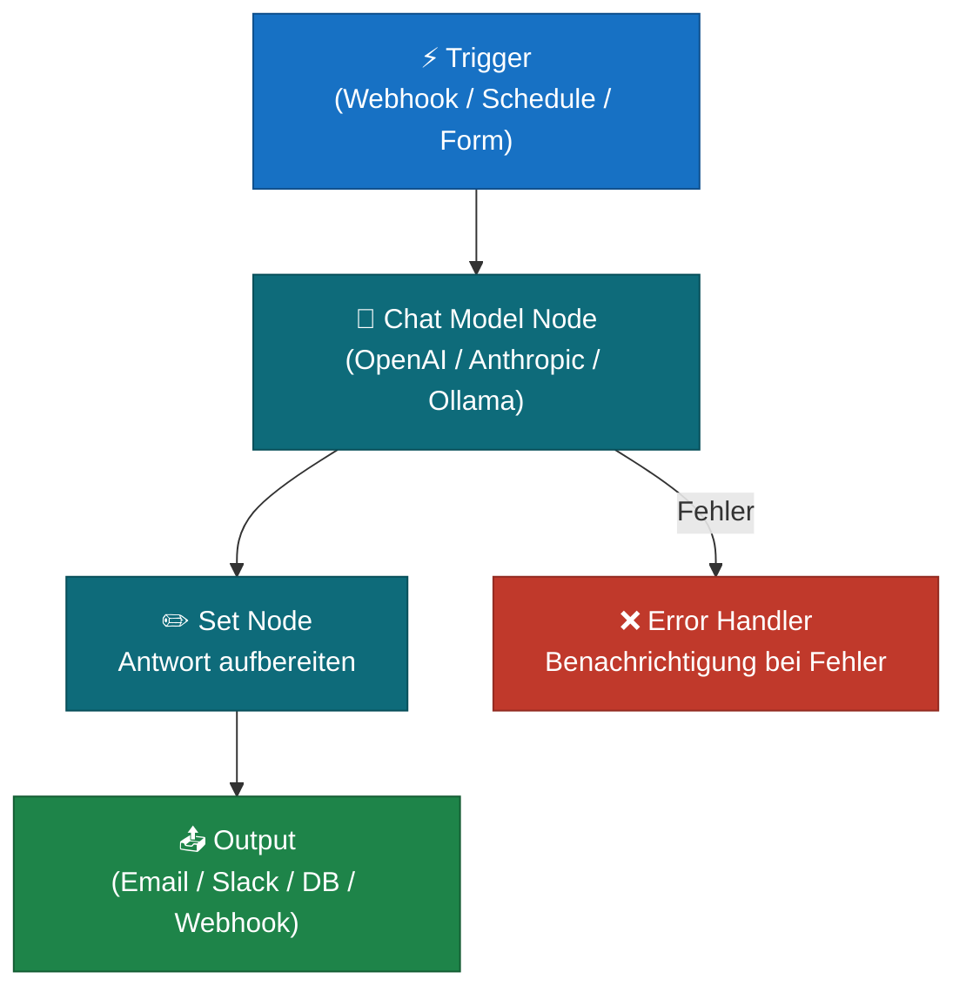
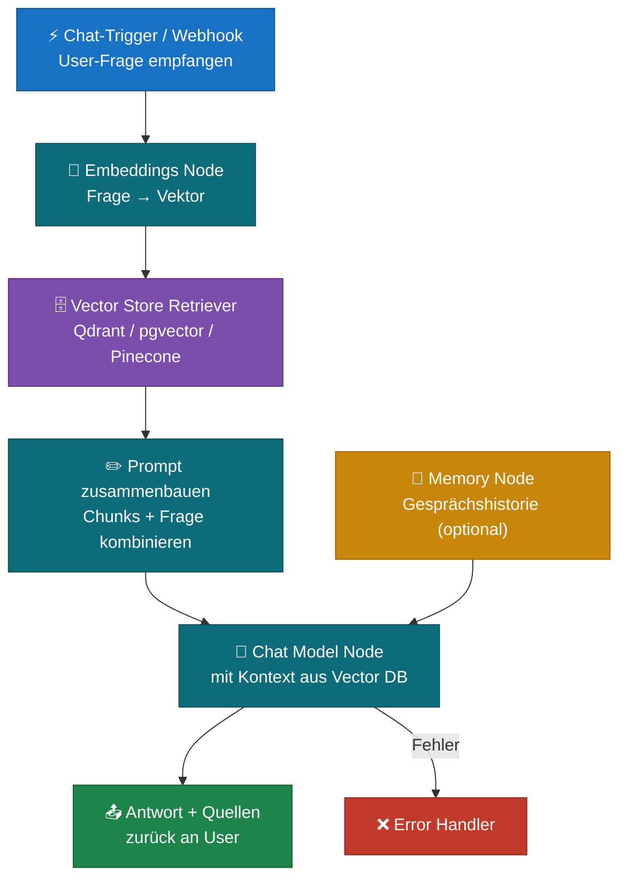
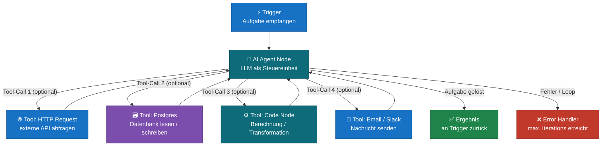
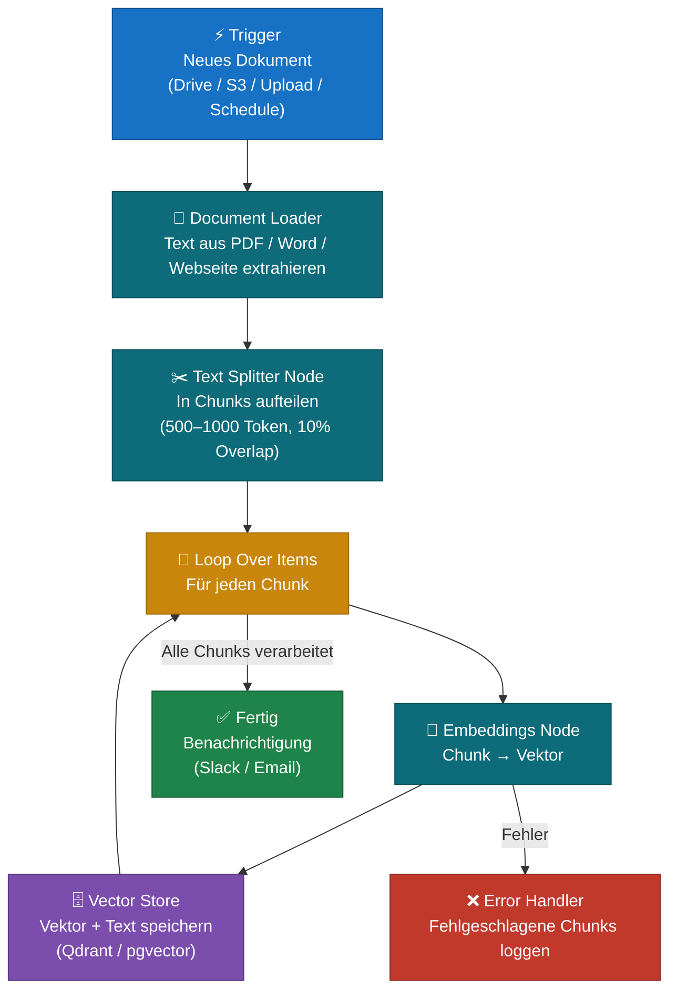
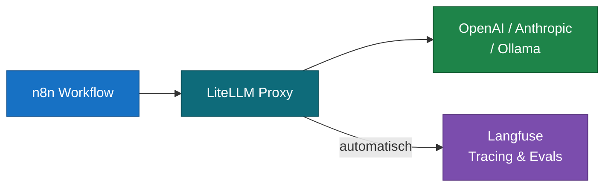

# n8n & LLM — Integration in der Praxis

> n8n ist die Klammer die alles verbindet: LLM-Calls, Datenbanken, APIs, Webhooks.
> Dieses Dokument zeigt wie n8n und die LLM-Infrastruktur aus `llm_learning/`
> zusammenspielen — mit den vier Kern-Patterns von einfach bis komplex.

Farbschema der Diagramme: [mermaid_color_schema.md](mermaid_color_schema.md)

---

## Was n8n in einer LLM-App übernimmt

| Ohne n8n | Mit n8n |
|---|---|
| Code für jeden Trigger | Visueller Workflow-Editor |
| Code für jede API-Verbindung | 300+ fertige Integrationen |
| Manuelle Orchestrierung | Automatische Ausführung & Scheduling |
| Kein UI für Nicht-Techniker | Business-User können Workflows anpassen |

n8n ersetzt nicht das LLM — es orchestriert den Datenfluss drum herum.

---

## Pattern 1 — Einfacher LLM-Call

### TLDR
> Trigger löst einen einzelnen LLM-Call aus, das Ergebnis wird weitergeleitet.
> Einstiegsmuster — kein Vorwissen nötig, in 15 Minuten aufgebaut.



### Typische Anwendungen
- Text zusammenfassen (Dokument rein → Summary raus)
- Übersetzen (DE → EN, EN → DE)
- Klassifizieren (Sentiment, Kategorie, Priorität)
- Einfache Frage-Antwort ohne eigene Daten

### Do's ✅
- **System-Prompt im Node setzen** — nicht nur eine User-Message schicken
- **`max_tokens` begrenzen** — sonst kann die Antwort beliebig lang werden
- **Error-Handler anhängen** — API-Calls können fehlschlagen (Rate Limit, Timeout)
- **Antwort in Set-Node normalisieren** bevor sie weitergeht

### Don'ts ❌
- Kein Retry-Mechanismus → bei Rate-Limit-Fehler bricht der Workflow ab
- Sensible Daten (Namen, IDs) direkt in den Prompt — erst pseudonymisieren
- Temperature auf 0 setzen und gleichzeitig kreative Antworten erwarten
- Ohne Langfuse arbeiten — du siehst nicht was das LLM tatsächlich bekommt

### Quellen
- [n8n Docs: AI / LLM Nodes Overview](https://docs.n8n.io/integrations/builtin/cluster-nodes/root-nodes/n8n-nodes-langchain.lmchatopenai/)
- [n8n Docs: Error Handling in Workflows](https://docs.n8n.io/flow-logic/error-handling/)
- [OpenAI API Reference: Chat Completions](https://platform.openai.com/docs/api-reference/chat)
- [Anthropic API Reference](https://docs.anthropic.com/en/api/getting-started)

---

## Pattern 2 — LLM mit eigenem Wissen (RAG)

### TLDR
> Die User-Frage wird in einen Vektor umgewandelt, semantisch ähnliche Dokument-Chunks
> aus einer Vector DB geholt und als Kontext an das LLM gegeben.
> Das LLM antwortet auf Basis deiner eigenen Daten — nicht aus seinem Training.



### Typische Anwendungen
- Chatbot der auf internen Handbüchern, FAQs oder Dokumentationen antwortet
- Support-Bot der Produktdokumentationen kennt
- HR-Assistent der Unternehmensrichtlinien kennt
- Legal-Bot der Verträge und Regelwerke durchsucht

### Do's ✅
- **Quellen mitschicken** — dem User zeigen welche Chunks genutzt wurden (Vertrauen)
- **Similarity-Threshold setzen** — keine Antwort wenn kein relevanter Chunk gefunden (besser als erfinden)
- **Memory-Node auf max. 10 Nachrichten** begrenzen — sonst explodieren die Token-Kosten
- **Indexierung automatisieren** — neues Dokument → automatisch in Vector DB (Pattern 4)
- **Mit Langfuse tracken** — welche Chunks werden abgerufen? Sind sie relevant?

### Don'ts ❌
- Nicht auf Tipp-Fehler in der Frage verlassen — Embedding-Suche verzeiht keine Rechtschreibung nicht so gut wie Keyword-Suche → Hybrid Search erwägen
- Chunks nicht zu groß wählen — 2000+ Token Chunks überfordern das LLM
- Memory ohne Limit — nach 20 Nachrichten kostet jede Anfrage ein Vielfaches
- Embedding-Modell beim Indexieren und Suchen nicht mischen

### Quellen
- [n8n Docs: AI Agent with Vector Store](https://docs.n8n.io/integrations/builtin/cluster-nodes/root-nodes/n8n-nodes-langchain.agent/)
- [n8n Docs: Vector Store Nodes](https://docs.n8n.io/integrations/builtin/cluster-nodes/root-nodes/n8n-nodes-langchain.vectorstoreqdrant/)
- [Qdrant Docs: Quick Start](https://qdrant.tech/documentation/quick-start/)
- [Langfuse: RAG Tracing](https://langfuse.com/docs/tracing-features/rag)
- [RAG Konzept erklärt](../llm_learning/rag_konzept_und_praxis.md)

---

## Pattern 3 — AI Agent mit Tools

### TLDR
> Ein Agent-Node bekommt eine Aufgabe und entscheidet selbst welche Tools er
> aufruft — Datenbank, API, Rechnung, E-Mail. Der Workflow definiert die
> verfügbaren Werkzeuge, das LLM steuert den Ablauf.



### Typische Anwendungen
- Buchungs-Assistent: Termin prüfen → in DB eintragen → Bestätigungsmail senden
- Daten-Recherche-Agent: mehrere APIs abfragen → zusammenfassen → Report erstellen
- Support-Agent: Ticket klassifizieren → in Helpdesk anlegen → User benachrichtigen
- Monitoring-Agent: Logs prüfen → bei Fehler Alert senden → Ticket erstellen

### Do's ✅
- **`maxIterations` immer setzen** — ohne Limit kann der Agent in Schleifen geraten
- **Tool-Beschreibungen präzise formulieren** — das LLM entscheidet anhand der Beschreibung welches Tool es nutzt
- **Jeden Tool-Call in Langfuse tracken** — du siehst welche Entscheidungen der Agent trifft
- **Deterministisches Modell für Tools** (Temperature 0) — Agents sollen zuverlässig sein, nicht kreativ
- **Tools auf das Minimum beschränken** — mehr Tools = mehr Fehlerquellen

### Don'ts ❌
- Agent ohne `maxIterations` laufen lassen — Endlosschleifen verursachen hohe Kosten
- Schreibende Operationen (DB-Updates, Emails senden) ohne Bestätigungsschritt — Agents machen Fehler
- Zu viele Tools gleichzeitig — Agents verlieren sich bei 8+ Tools
- Erwarten dass der Agent immer den kürzesten Weg nimmt — er kann unnötige Tool-Calls machen
- Ohne Human-in-the-Loop für kritische Aktionen (Geld überweisen, Daten löschen)

### Quellen
- [n8n Docs: AI Agent Node](https://docs.n8n.io/integrations/builtin/cluster-nodes/root-nodes/n8n-nodes-langchain.agent/)
- [n8n Docs: Tools für Agents](https://docs.n8n.io/integrations/builtin/cluster-nodes/sub-nodes/n8n-nodes-langchain.toolworkflow/)
- [LangChain: ReAct Agent Pattern](https://python.langchain.com/docs/modules/agents/agent_types/react)
- [Anthropic: Tool Use Guide](https://docs.anthropic.com/en/docs/build-with-claude/tool-use)

---

## Pattern 4 — Multi-Step Indexierungs-Pipeline

### TLDR
> Neue Dokumente werden automatisch verarbeitet: Text extrahieren → in Chunks
> aufteilen → Embeddings erstellen → in Vector DB speichern. Läuft einmalig
> oder automatisch bei neuen Dokumenten — hält den RAG-Index aktuell.



### Typische Anwendungen
- Neue Handbücher / PDFs automatisch in den Chatbot-Wissensstand aufnehmen
- Webseiten crawlen und als Wissenbasis speichern
- Support-Tickets in Vector DB indexieren für ähnliche-Tickets-Suche
- Confluence / Notion Seiten automatisch synchronisieren

### Do's ✅
- **Chunk-Größe dokumentieren** — wenn du später die Chunk-Größe änderst, musst du neu indexieren
- **Metadaten mitspecihern** (Dateiname, Datum, Quelle) — beim Retrieval als Quellenangabe nutzbar
- **Fehlerhafte Chunks separat loggen** statt den ganzen Workflow abzubrechen
- **Re-Indexierung bei Änderungen** einplanen — altes Dokument löschen, neu indexieren
- **Batch-Größe im Loop begrenzen** — zu viele parallele Embedding-Calls = Rate Limit

### Don'ts ❌
- Nicht alle Dokumente auf einmal indexieren ohne Batch-Kontrolle — OpenAI Rate Limits greifen schnell
- Keine Metadaten speichern — dann weißt du nicht woher ein Chunk stammt
- Chunks ohne Overlap — Informationen an Chunk-Grenzen gehen verloren
- Indexierung manuell anstoßen müssen — automatischer Trigger ist zuverlässiger
- Einmal indexieren und nie wieder — Dokumente ändern sich, Vector DB muss aktuell bleiben

### Quellen
- [n8n Docs: Document Loaders](https://docs.n8n.io/integrations/builtin/cluster-nodes/sub-nodes/n8n-nodes-langchain.documentdefaultdataloader/)
- [n8n Docs: Text Splitters](https://docs.n8n.io/integrations/builtin/cluster-nodes/sub-nodes/n8n-nodes-langchain.textsplitterrecursivecharactertextsplitter/)
- [n8n Docs: Loop Over Items](https://docs.n8n.io/flow-logic/looping/)
- [Qdrant: Collections & Upsert](https://qdrant.tech/documentation/concepts/collections/)
- [RAG Konzepte & Chunking](../llm_learning/rag_konzept_und_praxis.md)

---

## n8n Nodes für LLM-Arbeit

### KI-Nodes (eingebaut, kein Setup nötig)

| Node | Kategorie | Wofür |
|---|---|---|
| **AI Agent** | Agent | Autonomer Agent mit Tool-Use und eigenem Entscheidungsfluss |
| **Chat Model** | LLM | Direkter LLM-Call (OpenAI, Anthropic, Ollama, Mistral, …) |
| **Embeddings** | Vektoren | Text → Vektor umwandeln |
| **Vector Store** | Speicher | Vektoren speichern und abrufen (Qdrant, Pinecone, pgvector, …) |
| **Document Loader** | Daten | PDFs, Webseiten, Dateien in Text umwandeln |
| **Text Splitter** | Daten | Dokumente in Chunks aufteilen |
| **Memory** | Kontext | Gesprächshistorie für Chatbots |
| **Output Parser** | Shaping | LLM-Antwort in strukturiertes Format (JSON, Liste) umwandeln |

### Allgemeine Nodes die oft genutzt werden

| Node | Wofür |
|---|---|
| **HTTP Request** | Jede beliebige API (OpenAI direkt, Langfuse API, externe Services) |
| **Code** | Python oder JavaScript wenn kein Node reicht |
| **Webhook** | Trigger von außen (Chat-Widget, andere Apps, CI/CD) |
| **Postgres** | Direkt mit eigener Datenbank arbeiten |
| **Loop Over Items** | Chunks oder Dokumente einzeln verarbeiten |
| **IF / Switch** | Verzweigung basierend auf LLM-Antwort oder Klassifikation |
| **Set** | Daten umformen, umbenennen, für nächsten Node aufbereiten |

---

## Langfuse in n8n einbinden



**Option A — LiteLLM als Gateway (empfohlen)**
n8n → LiteLLM Proxy → LLM Provider. Langfuse bekommt automatisch alle Traces ohne extra Nodes.

**Option B — HTTP Request Node manuell**
Nach jedem LLM-Call einen HTTP-Node mit `POST /api/public/traces` an Langfuse anhängen. Mehr Kontrolle, mehr Aufwand.

**Option C — Community Node**
Im n8n Node-Browser nach "Langfuse" suchen. Einfachste Option wenn verfügbar.

→ [Langfuse Docs: n8n Integration](https://langfuse.com/docs/integrations/n8n)

---

## Ollama in n8n (lokal & kostenlos)

Ollama läuft lokal — kein API-Key, keine Kosten, Daten verlassen deinen Rechner nicht.

Im **Chat Model Node** einstellen:

```
Provider:  Ollama
Base URL:  http://localhost:11434
           (Docker: http://ollama:11434)
Model:     llama3.3 / mistral / phi4
```

Für **Embeddings** (RAG lokal):

```
Embeddings Node → Ollama → nomic-embed-text
```

→ Vollständige Anleitung: [lokale_llms_ollama.md](../llm_learning/lokale_llms_ollama.md)

---

## Grenzen von n8n für LLM-Arbeit

| n8n stark | Besser direkt im Code |
|---|---|
| Integrationen mit vielen Services | Komplexe Agent-Logik mit vielen Verzweigungen |
| Rapid Prototyping ohne Code | Performance-kritische Hochvolumen-Pipelines |
| Nicht-Techniker passen Workflows an | Feinsteuerung von Prompts und Parametern |
| Einfache bis mittlere Workflows | Verschachtelte Multi-Agent-Systeme |

> n8n ist kein Ersatz für LangChain oder LlamaIndex — es ist eine andere Schicht.
> Für komplexe RAG-Pipelines oder tiefe Agenten-Logik bleibt Code die bessere Wahl.
> Für Automatisierungen und Service-Integrationen ist n8n kaum zu schlagen.

---

## Weiterführende Docs

| Thema | Datei |
|---|---|
| RAG Konzept & Chunking | [rag_konzept_und_praxis.md](../llm_learning/rag_konzept_und_praxis.md) |
| Prompt Engineering | [llm_prompt_engineering.md](../llm_learning/llm_prompt_engineering.md) |
| Ollama lokal | [lokale_llms_ollama.md](../llm_learning/lokale_llms_ollama.md) |
| LLM-Kosten & Token | [llm_kosten_und_token.md](../llm_learning/llm_kosten_und_token.md) |
| Langfuse vs. LangSmith | [langfuse_vs_langsmith.md](../llm_learning/langfuse_vs_langsmith.md) |
| n8n Datenfluss | [n8n_datenfluss_kompendium.md](n8n_datenfluss_kompendium.md) |
